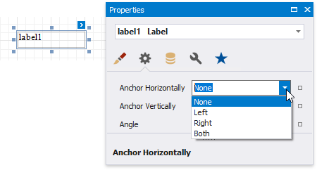
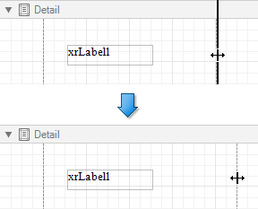
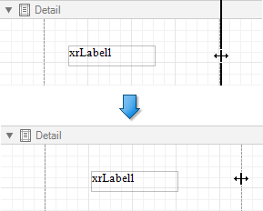
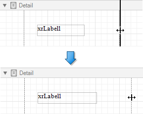

# Anchor Controls

You can anchor a control to the top, bottom, or both edges of its parent container using the **Anchor Horizontally** and **Anchor Vertically** properties.

* **Anchor Horizontally = None**

    

*  **Anchor Horizontally = Right**

    

* **Anchor Horizontally = Both**

    