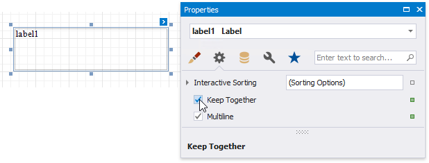
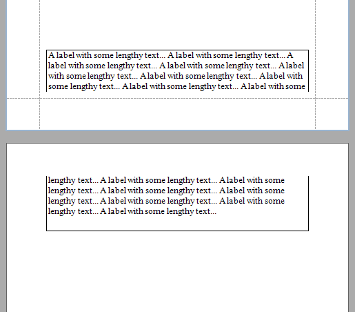
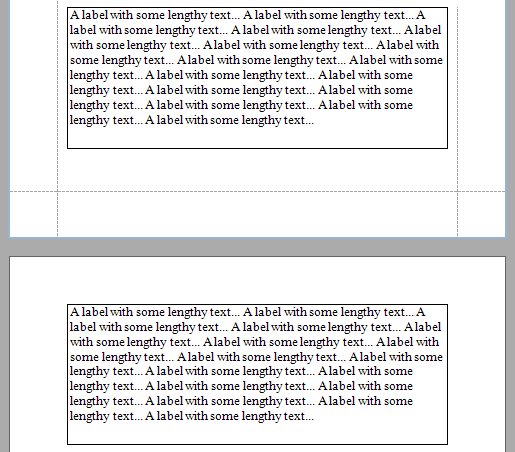

# Keep Content Together

You can choose whether a control's content can be split across several pages using its **Keep Together** property.

| **Keep Together = No** | **Keep Together = Yes** |
|---|---|
|  |  |

Enabling this property for a single control makes the same band's controls behave like this option is enabled.

Use the band's **Keep Together** property to enable this feature for all controls within a specific band.

> [!NOTE]
> This feature is not available for the [Chart](../use-report-elements/use-charts-and-pivot-grids/use-charts-in-reports.md), [Sparkline](../use-report-elements/use-gauges-and-sparklines/add-sparklines-to-a-report.md) and [Subreport](../use-report-elements/use-basic-report-controls/subreport.md) controls.

In a master-detail report, you can print the detail band on the same page as the detail report band using the detail band's **Keep Together With Detail Reports** property.
