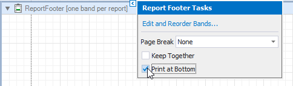
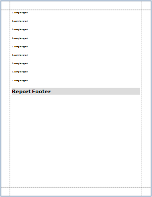
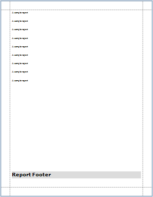
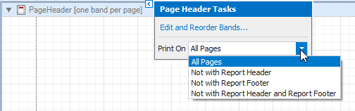
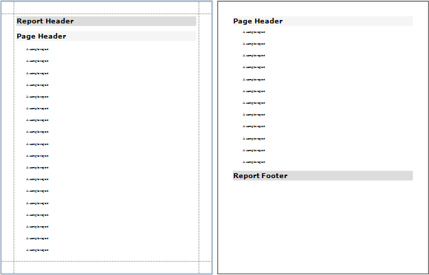
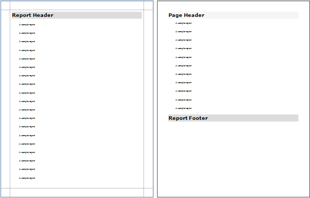
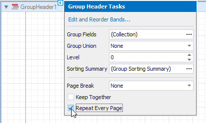
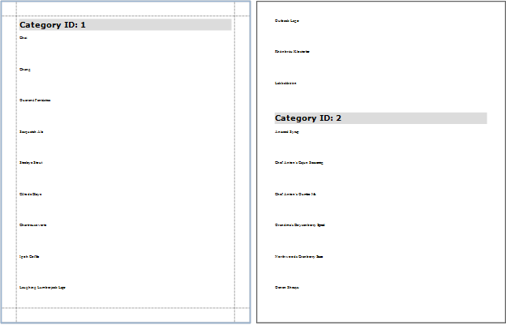
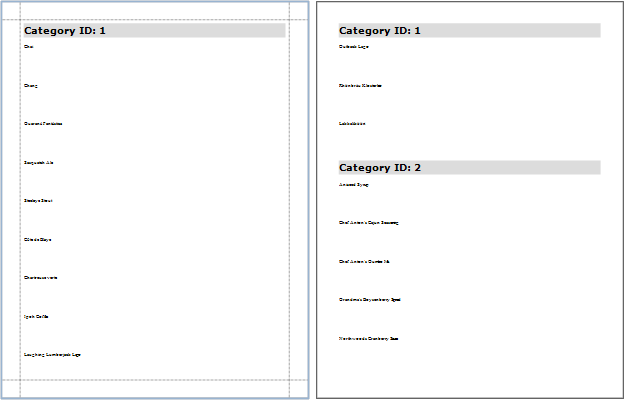

# Maintain the Band Location on a Page

Use the [Group and Report Footer](../introduction-to-banded-reports.md)'s **Print At Bottom** property to choose whether these bands should appear at the bottom of a page or immediately after the previous band.

| **Print at Bottom = No** | **Print at Bottom = Yes** |
|---|---|
|  |  |

Use the Page Header and Footer's **Print On** property to avoid printing these bands on the same page with a Report Header and/or Footer.

* **Print On = All Pages**

    

* **Print On = Not With Report Header**

    

Use the Group Header and Footer's **Repeat Every Page** property to repeat these bands on every page.

* **Repeat Every Page = No**

    

* **Repeat Every Page = Yes**

    