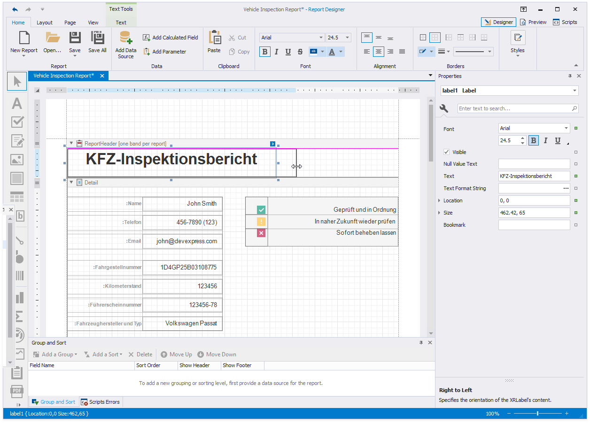
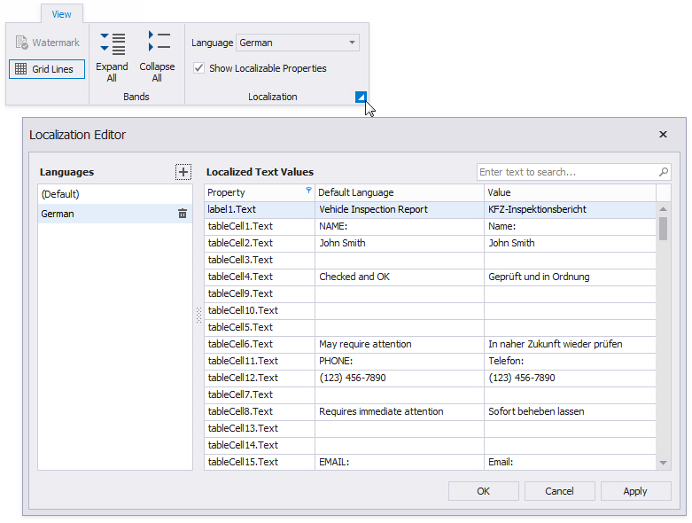

# Localize Reports

This document describes how to localize a report for different languages and cultures.

To localize a report, open it in the Report Designer and specify a report language other than _Default_. Change the reporting controls' text, sizes, and locations and save the report. All language-specific changes are saved with the report. When a localized report is displayed in Preview, the document contains modifications that match the application's culture.

Perform the following actions to localize a report:

1. In the Report Designer Toolbar, switch to the **View** tab and select the language in the drop-down list in the **Localization** group.

    

2. Enable the **Show Localizable Properties** option to display only localizable properties in the [Property Grid](report-designer-tools/ui-panels/property-grid-tabbed-view.md).

    

3. Edit the report layout and change the controls' property values. You can move and resize a control.

    

4. Click the **dialog box launcher** to invoke the [Localization Editor](report-designer-tools/localization-editor.md). It allows you to change text strings in the report and expedite the translation process.

    

5. Save the report. Localized values are stored in the report file.
