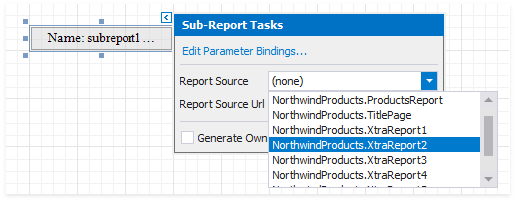

# Use Data-Driven Page Sequence

This topic describes how to combine a table report that uses the Portrait page orientation and a chart report that uses the Landscape page orientation.

Follow the steps below to create a combined report:

## Create a Chart Report

1. Create a chart report that shows all products in a category. The report is [bound](../bind-to-data/bind-a-report-to-a-database.md) to the sample **Northwind** database's **Products** table. Set the report's **Landscape**** property to **true** to enable the Landscape page orientation.

    

1. Add the **CatID** parameter to your chart report to specify which product category to build the chart for. Right-click **Parameters** in the **Field List** and choose **Add Parameter**.

    

1. Select the created parameter and set its **Name** property to **CatID**, **Type** to **Int32** and uncheck the **Visible** option.

    

1. Click the report's smart tag. Click the **Filter String** option's ellipsis button. In the invoked [FilterString Editor](../shape-report-data/filter-data/filter-data-at-the-report-level.md), construct an expression to compare the **CategoryID** data field to the **CatID** parameter. To access the parameter, click the icon on the right until it turns into a question mark.

    

## Create the Base Report

1. [Join](../report-designer-tools/query-builder.md) the **Northwind** database's **Products** and **Categories** tables. Create a report [bound](../bind-to-data/bind-a-report-to-a-database.md) to the resulting query, and arrange a layout like the one shown below:

    

1. Right-click the base report's **Detail** band and select the **Insert Band** / **Group Footer** item in the context menu.

	

1. Drag a [Subreport](../use-report-elements/use-basic-report-controls/subreport.md) item from the Toolbox onto the added group footer band.

    

1. Click the subreport control's smart tag. In the **Sub-Report Tasks** window, set the **Report Source** parameter to the chart report's location.

    

1. Enable the **Generate Own Pages** option to print the embedded report on separate pages and use its own page settings.

    

1. Bind the chart report's **CatID** parameter to the base report's **CategoryID** data field. Click the subreport's smart tag and select **Edit Parameter Bindings** in the invoked **SubReport Tasks** window.

    

1. The **Parameter Bindings Collection Editor** is invoked. Click **Add** to add a new binding. In the binding properties list, specify the data field to bind to and the parameter name to bind.

    

1. Switch to Preview mode to see the combined report.

    

Your base report's **Table of Contents** and **Document Map** include bookmarks from the embedded report. Use the **Parent Bookmark** property to specify the nesting level for the embedded report's bookmarks.
