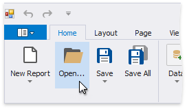
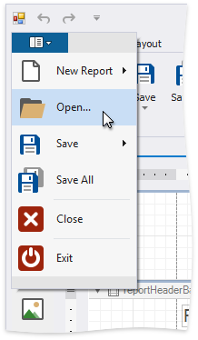

# Open Reports

You can use different commands to open a report. The **Open** dialog displays [saved report files](save-reports.md) with the REPX extension. These files store information about the report's layout. Select a report file and press **Open**.

### Use the Ribbon Application Menu

Click **Open...**.

### Use the Ribbon Application Menu

Click the application button and then **Open...** in the invoked application menu.

### Use a Shortcut

You can also use the CTRL+O shortcut to open a report.
