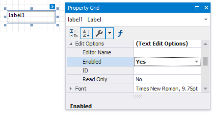
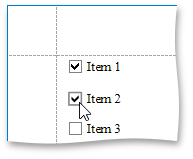
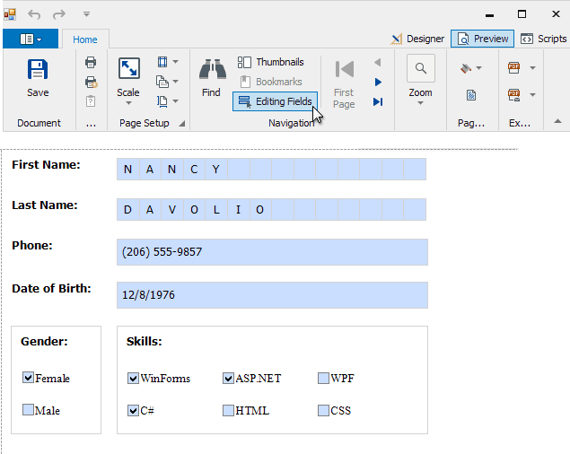
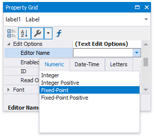
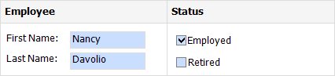
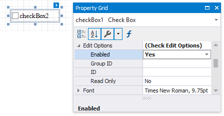

# Edit Content in Print Preview

This document provides information about interactive document editing in Print Preview that enables you to customize field values directly in a previewed document before printing or exporting it.

## Content Editing Overview
When content editing is enabled for a report control (either unbound or data-aware), it is possible to customize the corresponding field values in Print Preview.

To enable content editing for a report control, expand its **EditOptions** property and set the **Enabled** property to **true**.

When the **EditOptions.Enabled** property is set to **true** and the **EditOptions.ReadOnly** property is disabled, the control's content can be edited in Print Preview (clicking a field will invoke the appropriate editor).

The following standard editors can be assigned to a control, depending on the kind of content it displays.

| Memo Edit | Check Box |
|---|---|
|  |  |

To highlight all editing fields available in a document, click the **Editing Fields** button on the Print Preview toolbar. This button is disabled when there are no such fields in a document.

To navigate between editing fields in Print Preview, use the TAB and SHIFT+TAB keys.

### Content Editing Specifics

When enabling content editing in your report, consider the following.

* The changes made to a control's content in Print Preview have no effect on other parts of the document (e.g., the related summary results, grouping, sorting, bookmarks and other settings that have already been processed before generating the document).
* A contol's **CanGrow** setting is ignored for editing fields.
	
	Multi-line values can only be entered when no mask is applied to an editing field. The editing area of a field cannot exceed the original dimensions of a control.
* Values entered into editing fields are reset back to their defaults after refreshing the document (e.g., when submitting [report parameter](..\shape-report-data\use-report-parameters.md) values and expanding or collapsing data in a [drill-down report](create-drill-down-reports.md)).
* It is impossible to edit content of a control that has its **DrillDownControl** property specified.
* Field values entered in Print Preview for controls placed onto the Top Margin and Bottom Margin bands are not preserved when the report is exported to TXT or CSV, as well as the following formats as a single file.
	
	* HTML
	* MHT
	* RTF
	* XLS
	* XLSX
	* image

To learn about the specifics of editing different kinds of content, see the following sections in this document.

* [Text Editing](#textediting)
* [Check Box Editing](#editingcheckbox)

## Text Editing
The [Label](..\use-report-elements\use-basic-report-controls\label.md), [Table Cell](..\use-report-elements\use-tables.md) and [Character Comb](..\use-report-elements\use-basic-report-controls\character-comb.md) controls can be assigned editors to customize their content in Print Preview.

To enable content editing for these controls, expand their **EditOptions** property and set the **Enabled** property to **true**.

The following editors can be used to customize a field's content in Print Preview.

* **Default Editor**
	
	By default, the **EditorName** property is not specified, and a memo edit is used as a standard editor.
	
	
* **Specific Value Editors**
	
	You can assign a specific editor to a control using its **EditorName** property.
	
	
	
	The standard editors are divided into the following categories.
	
	<table><tr><th>
Numeric

    </th><th>
Date-Time

    </th><th>
Letters

    </th></tr><tr><td><ul>
    <li>Integer</li>
    <li>Integer Positive</li>
    <li>Fixed-Point</li>
    <li>Fixed-Point Positive</li>
    </ul>
    </td><td><ul>
    <li>Date</li>
    </ul>
    </td><td><ul>
    <li>Only Letters</li>
    <li>Only Uppercase Letters</li>
    <li>Only Lowercase Letters</li>
    <li>Only Latin Letters</li>
    </ul>
    </td></tr></table>

> [!NOTE]
> If a table cell contains other controls, its editing is disabled (but not the editing of the controls contained in this cell), which is illustrated in the following image.
> 
> 

## Check Box Editing
The [Check Box](..\use-report-elements\use-basic-report-controls\check-box.md) control's value can be edited in Print Preview.

To enable content editing for a check box, expand its **EditOptions** property and set the **Enabled** property to **true**.

In Print Preview, the control's behavior depends on the **GroupID** setting.

* When this property is set to **null** or an empty string value, a check box can be switched either to the "checked" or "unchecked" state (the "intermediate" state is not supported) independently on other available check boxes.
	
	
* Otherwise, the field editor behaves like a radio button, and editors with the same **GroupID** value belong to a single logical group (i.e., only one option can be selected within a group at a time).

