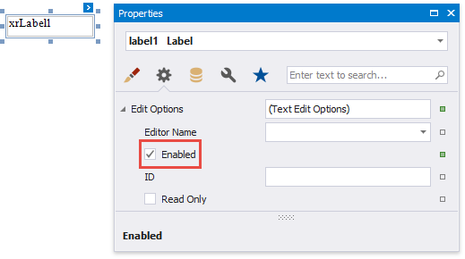

# Edit Content in Print Preview

This document describes how to customize field values in a previewed document.

## Content Editing Overview
Enable a report control's **Edit Options** | **Enabled** property and leave the **Edit Options** | **Read Only** property disabled to make the control's content editable in Print Preview.

Print Preview provides the **Editing Fields** toolbar button if content editing is enabled for at least one control in the displayed report. Click this button to highlight all editable fields available in the document.

Use the TAB and SHIFT+TAB keys to navigate between editable fields forward and back.

Click an editable field to invoke an editor and specify a value.

You can enable content editing for data-aware and unbound report controls.

The following report controls support content editing in Print Preview:

| Text | Boolean | Image |
|--- | --- | --- |
| [Label](..\use-report-elements\use-basic-report-controls\label.md) | [Check Box](..\use-report-elements\use-basic-report-controls\check-box.md) | [Picture Box](..\use-report-elements\use-basic-report-controls\picture-box.md) |
| [Table Cell](..\use-report-elements\use-tables.md) | | |
| [Character Comb](..\use-report-elements\use-basic-report-controls\character-comb.md) | | |

The sections below provide information about options these controls expose. You can use these options to set up content editing.

## Content Editing Limitations

* Changes made to a control's content in Print Preview does not effect the document's other parts (for example, summary results, grouping, sorting, bookmarks and other settings that were processed before the document was generated).
* A control's **Can Grow** setting is ignored for editable fields. The edited area cannot exceed the control's original dimensions.
* Multi-line values can only be entered when no mask is applied to an editable field.  
* Values entered into editable fields are reset after the document is refreshed (for example, when you submit [report parameter](..\shape-report-data\use-report-parameters.md) values or expand/collapse data in a [drill-down report](create-drill-down-reports.md)).
* It is not possible to edit content in bands if their **DrillDownControl** property is specified.
* The entered values are not preserved in the Top Margin and Bottom Margin bands when the report is exported as a single file to the following formats:

    * TXT
    * CSV
	* HTML
	* MHT
	* RTF
	* XLS
	* XLSX
	* image

## Text Editors

Text editors are used to customize the [Label](..\use-report-elements\use-basic-report-controls\label.md), [Table Cell](..\use-report-elements\use-tables.md) and [Character Comb](..\use-report-elements\use-basic-report-controls\character-comb.md) report controls' content in Print Preview.

The default text editor is a memo edit. 
	
	

Specify the **Edit Options** | **Editor Name** property to use one of the following text editors:

| Numeric | Date-Time | Letters |
| --- | --- | --- |
| Integer | Date | Only Letters | 
| Positive Integer | | Only Uppercase Letters |
| Fixed-Point | | Only Lowercase Letters |
| Positive Fixed-Point | | Only Latin Letters |

Each editor has a specific mask.
	
> [!NOTE]
> If a table cell contains other controls, you cannot edit this cell (they can edit the cell's controls). The following image illustrates this:
> 
> 

## Check Box Editor
The check box editor is used to customize the [Check Box](..\use-report-elements\use-basic-report-controls\check-box.md) report control's content in Print Preview.

You can combine several check box editors into a radio group so that you can select only one option within a group at a time. For this, set the [Check Box](..\use-report-elements\use-basic-report-controls\check-box.md) report controls' **Group ID** property to the same value.

## Image Editors

Image editors are used to customize the [XRPictureBox](..\use-report-elements\use-basic-report-controls\picture-box.md) report control's content in Print Preview.

Use the control's **Edit Options** | **Editor Name** property to assign one of the following image editors.

- **Image Editor**  
    Allows you to load an image and specify the image's size options.

    

- **Signature Editor**  
    Allows you to specify brush options and draw a signature.

    
- **Image and Signature Editor** (default)  
    Allows you to load an image and draw a signature. The image's size options and brush options are available.

    

All these image editors include the  button. This button allows you to clear the editor's content.
