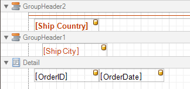
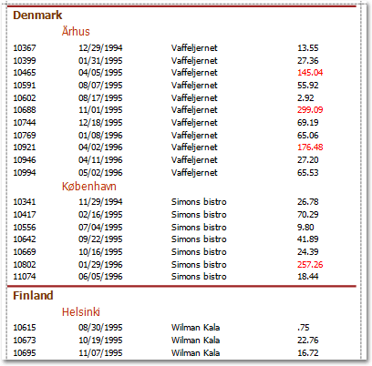
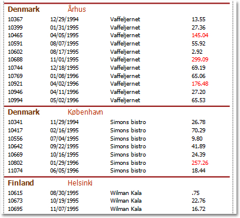

# Grouping Bands
The **Group Header** and **Group Footer** bands are shown above and below each group. Usually, you don't need to manually manage these bands, as they are auto-created via the [Group and Sort Panel](../report-designer-ui/group-and-sort-panel.md). For more information, refer to [Change or Apply Data Grouping to a Report](../../report-editing-basics/change-or-apply-data-grouping-to-a-report.md) and [Change or Apply Data Sorting to a Report](../../report-editing-basics/change-or-apply-data-sorting-to-a-report.md).

You may use the Group Header bands for grouping by multiple data fields in one of the following ways.
1. Add several Group Header bands. Specify one group field for each of these bands.
	
	
	
	This results in nested grouping of the report's data.
	
	
2. Specify several group fields for the **Group Fields** property of the Group Header band. The data will be grouped by certain combinations of field values.
	
	

The Group Footer band is unnecessary without the corresponding Group Header band, to which its properties are similar. The Group Footer can be used to display [group totals](../../report-editing-basics/add-totals-to-a-report.md), or [group page numbers](../../create-reports/miscellaneous/add-page-numbers-for-groups.md).

In the [Property Grid](../report-designer-ui/property-grid.md), the properties of both these bands are divided into the following groups.

## Appearance
* **Background Color**
	
	Specifies the background color for the controls contained within the band. This option is also available in the [Formatting Toolbar](../report-designer-ui/formatting-toolbar.md) ().
* **Borders**, **Border Color**, **Border Dash Style** and **Border Width**
	
	Specify border settings for the controls contained within the band.
* **Font**
	
	Specifies the font settings for the controls contained within the band. Some of these settings are available in the [Formatting Toolbar](../report-designer-ui/formatting-toolbar.md).
* **Foreground Color**
	
	Specifies the text color for the controls contained within the band. This option is also available in the [Formatting Toolbar](../report-designer-ui/formatting-toolbar.md) ().
* **Formatting Rules**
	
	Invokes the Formatting Rules Editor allowing you to choose which rules should be applied to the band during report generation, and define the precedence of the applied rules. To learn more on this, refer to [Conditionally Change a Control's Appearance](../../create-reports/styles-and-conditional-formatting/conditionally-change-a-controls-appearance.md).
* **Padding**
	
	Specifies indent values which are used to render the contents of the controls contained within the bands.
* **Style Priority**
	
	Allows you to define the priority of various style elements (such as background color, border color, etc.). For more information on style inheritance, refer to [Understanding Style Concepts](../../create-reports/styles-and-conditional-formatting/understanding-style-concepts.md).
* **Styles**
	
	This property allows you to define [odd and even styles](../../create-reports/styles-and-conditional-formatting/use-odd-and-even-styles.md) for the controls contained within the bands, as well as to assign an existing style to them (or a newly created one). For more information on style inheritance, refer to [Understanding Style Concepts](../../create-reports/styles-and-conditional-formatting/understanding-style-concepts.md).
* **Text Alignment**
	
	Allows you to change the text alignment of the controls contained within the bands. This option is also available in the [Formatting Toolbar](../report-designer-ui/formatting-toolbar.md).

## Behavior
* **Drill-Down Control**
	
	Specifies a control used to expand/collapse the current report band. This property provides automatic [drill-down](../../create-reports/report-types/drill-down-report.md) functionality to report bands.
* **Drill-Down Expanded**
	
	Specifies whether the current report band is expanded or collapsed when using the automatic [drill-down](../../create-reports/report-types/drill-down-report.md) feature.
* **Group Fields**
	
	This property is available for the Group Header band only. It invokes the Group Field Collection Editor, allowing you to add and remove grouping fields, define data fields to be used as grouping criteria and the grouping order (ascending or descending).
	
	In most scenarios, it's quick and practical to use the [Group and Sort Panel](../report-designer-ui/group-and-sort-panel.md), rather than manually adjust the band's group fields collection. However, this is the only way to assign multiple group fields to a single Group Header.
* **Group Union**
	
	Determines whether group rows can be printed on different pages (in this case both Group Union and Group Footer Band.Group Union are set to None), or the entire group will be printed on a single page (if the Group Union is set to Whole Page).
	
	Also, if a group can be split across pages, but you don't want a Group Header to be printed on a page if there is no data row below it (in case a group starts at the bottom of the page and there is enough room for only a Group Header), you may set the Group Union to With First Detail. In this case, if a Group Header is alone on a page, it will be moved to the beginning of the next page.
	
	It is the same for the Group Footer. If you don't want it to be printed alone on a page, you may set its Group Union to With Last Detail, and the last group row from the previous page will be moved to the next page to be printed together with a Group Footer.
	
	This property is quickly accessible via the band's [Smart Tag](../report-designer-ui/smart-tag.md).
* **Keep Together**
	
	When this option is on, the report tries to fit the band contents entirely on one page, not allowing it to split across several pages. In general, if the contents are too large to fit on a single page, then the band is started on a new page, and continues on the following page.
* **Level**
	
	Specifies the nesting level of a group band. The lower the level number, the closer the group band is to the Detail band. The numeration starts at zero. It is the parameter that identifies the Group Header / Group Footer band pairs.
	
	This option is auto-defined when using the [Group and Sort Panel](../report-designer-ui/group-and-sort-panel.md).
* **Page Break**
	
	Use this property if the current report design requires that the band's section should be separated from previous sections or follow-ups. Specify the Before the Band or After the Band values to insert a page break before or after the current band. In many cases, this property may be used instead of the [Page Break](../report-controls/page-break.md) control.
* **Print at Bottom**
	
	This property is available for the Group Footer band only. It determines whether the band should be printed at the bottom of a page, or immediately after the last group's details.
	
	If a report contains several Group Footers with their Print at Bottom properties set to different values, then the outer Group Footer has the highest priority.
	
	This feature is helpful when the Page Break property of the Group Header band is set to After the Band. In this instance each group starts a new page, and the Group Footer has two distinct places to reside - after the last row, or at the bottom of the page.
* **Repeat Every Page**
	
	This property improves the readability of reports with group contents that are several pages long. Without a repeated group header at the top of the page, the report may be difficult to read.
	
	This property is also accessible via the band's [Smart Tag](../report-designer-ui/smart-tag.md).
* **Scripts**
	
	This property contains events, which you can handle with the required scripts. For more information on scripting, refer to [Handle Events via Scripts](../../create-reports/miscellaneous/handle-events-via-scripts.md).
* **Sorting Summary**
	
	This property is available for the Group Header band only. It allows you to [sort groups by a summary function result](../../create-reports/miscellaneous/sort-groups-by-a-summary-function-result.md).
* **Visible**
	
	Specifies whether the bands should be visible in print preview.

## Data
* **Tag**
	
	This property allows you to add some additional information to the band; for example its id, by which it can then be accessible via [scripts](../../create-reports/miscellaneous/handle-events-via-scripts.md).

## Design
* **(Name)**
	
	Determines a band's name, by which it can be accessed in the [Report Explorer](../report-designer-ui/report-explorer.md), [Property Grid](../report-designer-ui/property-grid.md) or via [scripts](../../create-reports/miscellaneous/handle-events-via-scripts.md).

## Layout
* **Height**
	
	Specifies the band's height, in [report units](../../create-reports/basic-operations/change-measurement-units-of-a-report.md).
* **Snap Line Padding**
	
	Specifies the padding (in [report measurement units](../../create-reports/basic-operations/change-measurement-units-of-a-report.md)), which is to be preserved within the band when controls it contains are [aligned using Snap Lines](../../create-reports/basic-operations/controls-positioning.md).

## Structure
* **Sub-Bands**
	
	Allows you to invoke the Sub-Band Collection Editor intended to manage and customize the band's collection of [sub-bands](sub-bands.md).