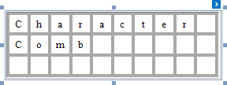
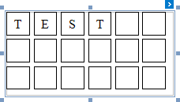
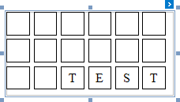
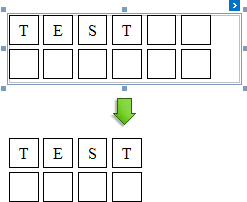
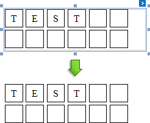
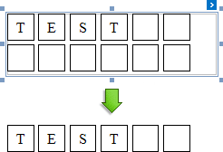
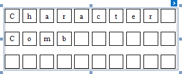
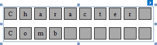

# Character Comb
The **Character Comb** control displays text so that each character is printed in an individual cell.

When exporting this control to [third-party formats](../../../../print-preview/print-preview-for-winforms/exporting/exporting-from-print-preview.md), consider the following
* When a report is exported to an [XLS](../../../../print-preview/print-preview-for-winforms/exporting/xls-specific-export-options.md) or [XLSX](../../../../print-preview/print-preview-for-winforms/exporting/xlsx-specific-export-options.md) file, the cells of the Character Comb correspond to the cells of a resulting Excel sheet.
* When a report is exported to a [CSV](../../../../print-preview/print-preview-for-winforms/exporting/csv-specific-export-options.md) (or [TXT](../../../../print-preview/print-preview-for-wpf/exporting/text-specific-export-options.md)) file, the content of individual cells is separated (or spaced) by a specified **Separator** character.

In the [Property Grid](../report-designer-ui/property-grid.md), the Character Comb options are divided into the following groups.

## Appearance
* **Background Color**
	
	Specifies the background color for the control. This option is also available in the [Formatting Toolbar](../report-designer-ui/formatting-toolbar.md) ().
* **Borders**, **Border Color**, **Border Dash Style** and **Border Width**
	
	Specify border settings applied to the control's cells.
	
	When the cell spacing is set to zero, the borders of adjacent cells are merged (i.e., the actual border width is not doubled). The following images illustrate how cell spacing affects the **Border Width** property behavior.
	
	| Cell Spacing = 0 | Cell Spacing = 1 |
	|---|---|
	|  |  |
	
	When the control's content is to be printed on multiple pages, a page break occurring at a horizontal border of a cell will move the entire row above this border to the next page and split its upper border in two parts (one half stays on the previous page, and the other half moves to the next). However, this is not the case if the vertical cell spacing is not zero, in which case the same border width is maintained on both pages.
* **Font**
	
	Specifies the font settings for the control. Some of these settings are available in the [Formatting Toolbar](../report-designer-ui/formatting-toolbar.md).
* **Foreground Color**
	
	Specifies the text color for the control. This option is also available in the [Formatting Toolbar](../report-designer-ui/formatting-toolbar.md) ().
* **Formatting Rules**
	
	Invokes the Formatting Rules Editor, allowing you to choose which rules should be applied to the control during report generation, and define the precedence of the applied rules. To learn more on this, refer to [Conditionally Change a Control's Appearance](../../create-reports/styles-and-conditional-formatting/conditionally-change-a-controls-appearance.md).
* **Style Priority**
	
	Specifies the priority of various style elements (such as background color, border color, etc.). For more information on style inheritance, refer to [Understanding Style Concepts](../../create-reports/styles-and-conditional-formatting/understanding-style-concepts.md).
* **Styles**
	
	Specifies [odd and even styles](../../create-reports/styles-and-conditional-formatting/use-odd-and-even-styles.md) for the control and enables you to assign an existing style to the control (or a newly created one). To learn more, see [Understanding Style Concepts](../../create-reports/styles-and-conditional-formatting/understanding-style-concepts.md).
* **Text Alignment**
	
	Specifies the alignment of the control's text. This option is also available in the [Formatting Toolbar](../report-designer-ui/formatting-toolbar.md).
	
	| Text Alignment = Top Left | Text Alignment = Middle Center | Text Alignment = Bottom Right |
	|---|---|---|
	|  |  |  |

## Behavior
* **Anchor Horizontally**
	
	Specifies the horizontal anchoring style of a control, so that after page rendering it stays attached to the left control, right control, or both. This property defines how a report control is resized to maintain the distance to the left and right edges of its container control.
* **Anchor Vertically**
	
	Specifies the vertical anchoring style of a control, so that after page rendering it stays attached to the top control, bottom control, or both. The property setting is useful for data-bound controls located between upper and lower controls, which are allowed to resize depending on their contents.
	
	Note that if the Anchor Vertically property is set to Bottom or Both, the Can Grow and Can Shrink property (see below) values are ignored, and don't participate in calculating a final height value of this control.
* **Auto Width**
	
	Specifies whether or not a control's width should be automatically determined based on its text.
	
	| Auto Width = Yes | Auto Width = No |
	|---|---|
	|  |  |
* **Can Grow**
	
	When this property is set to Yes, a Character Comb's height can be automatically increased, if required, to display the text. If there are other controls below the current control, they will be pushed down to prevent them from overlapping. Note that if a control overlaps the growing Character Comb by even one pixel, it will not be pushed down by the growing control.
* **Can Publish**
	
	Specifies whether or not a control is displayed in a printed or exported document.
* **Can Shrink**
	
	When this property is set to Yes, and the text does not completely fill a control's dimensions, the control's height will be decreased to the height of its text. If there are other controls below the current control, they will be moved up to fill the gap. Note that if a control overlaps the shrinking Character Comb by even one pixel, it will not be pushed up by the shrinking control.
	
	| Can Shrink = Yes | Can Shrink = No |
	|---|---|
	|  |  |
* **Edit Options**
	
	Provides access to options that define whether and how a control's content can be edited in Print Preview. For more information, see [Enable Content Editing in Print Preview](../../create-reports/report-navigation-and-interactivity/enable-content-editing-in-print-preview.md).
* **Keep Together**
	
	Specifies whether the contents of a Character Comb can be horizontally split across pages. In other words, if a Character Comb occupies more space than remains on the page, this property specifies whether this Character Comb should be split between the current page and the next, or whether it will be printed entirely on the next page. This property is in effect only when a Character Comb's content does not fit on the current page. If it does not fit on the next page either, then the Character Comb will be split, irrespective of this property's value.
* **Multiline**
	
	When this property is set to Yes, a Character Comb processes newline characters found in the text to start a new line. For example, when editing a Character Comb's text, you can insert a new line by pressing ENTER, and in this case, the Multiline property will be automatically set to Yes.
* **Process Duplicates Mode**
	
	Determines the control's behavior when its data source contains consecutive repeating records. They can be processed as is (when the property is set to Leave), suppressed except for the first entry (Suppress) and suppressed with the blank space printed instead of the repeated records (Suppress and Shrink).
	
	When the MergeByValue and MergeByTag settings are selected, the control processes duplicate values by merging the identical content into a single line of text.
* **Process Duplicates Target**
	
	Specifies whether to process duplicate values of the control's Text or Tag property.
* **Process Null Values**
	
	Determines whether to process Null (blank) values if they appear in the control's data source. They can be processed as is (when the property is set to Leave), suppressed (Suppress) and suppressed with the blank space printed instead of the blank records (Suppress and Shrink).
* **Scripts**
	
	This property contains events, which you can handle with the required scripts. For more information on scripting, refer to [Handle Events via Scripts](../../create-reports/miscellaneous/handle-events-via-scripts.md).
* **Visible**
	
	Specifies whether the control should be visible in print preview.
* **Word Wrap**
	
	When this property is set to Yes, text entered into the multiline Character Comb is wrapped to the next line if it doesn't fit the line or comes across a newline character. If the this property is set to No, text entered into the multiline Character Comb will be displayed on the same line until a newline character is entered.

## Data
* **(Data Bindings)**
	
	If the current report is [bound to data](../../create-reports/binding-a-report-to-data.md), this property allows you to bind some of the control's properties (Bookmark, Navigation URL, Tag and Text) to a data field obtained from the report's data source, and to apply a [format string](../../report-editing-basics/change-value-formatting-of-report-elements.md) to it. For more information on this, refer to [Displaying Values from a Database (Binding Report Elements to Data)](../../report-editing-basics/displaying-values-from-a-database-(binding-report-elements-to-data).md).
* **Lines**
	
	Provides access to the Text property of a Character Comb in the Multiline mode.
* **Null Value Text**
	
	Specifies the text displayed by a control when the value of its bound data field is null.
* **Summary**
	
	Allows you to perform calculations (summary, max, min, average, etc.) over a data field. For more information on calculating summaries, refer to [Add Totals to a Report](../../report-editing-basics/add-totals-to-a-report.md).
	
	> [!NOTE]
	> Summarization is possible for a single data column only. To perform calculations with several data fields, use [calculated fields](../../report-editing-basics/add-calculated-fields-to-a-report.md).
* **Tag**
	
	This property allows you to add some additional information to the control; for example its id, by which it can then be accessible via [scripts](../../create-reports/miscellaneous/handle-events-via-scripts.md).
	
	If the current report [has a data source](../../create-reports/binding-a-report-to-data.md), the Tag property can be bound to a data field obtained from the data source. To do this, expand the (Data Bindings) property and in the Tag.Binding drop-down selector, select the required data field.
* **Text**
	
	Allows you to define a line of static text to be displayed. To type several lines of text, click the control's [Smart Tag](../report-designer-ui/smart-tag.md), and in the invoked actions list, click Edit Text, or use the Lines property. Note that when a Character Comb is selected in the designer, you may simply start typing the text, and it will be automatically entered into the in-place editor.
	
	
	
	If the current report [has a data source](../../create-reports/binding-a-report-to-data.md), the Text property can be bound to a data field obtained from the data source. To do this, expand the (Data Bindings) property and in the Text.Binding drop-down selector, select the required data field. For more information on this, refer to [Displaying Values from a Database (Binding Report Elements to Data)](../../report-editing-basics/displaying-values-from-a-database-(binding-report-elements-to-data).md).
* **Xlsx Format String**
	
	Specifies the native XLSX format string for the control's content, which is to be preserved when the report is being [exported](../../../../print-preview/print-preview-for-winforms/exporting/exporting-from-print-preview.md) to XLSX. This format string is independent from the general [value formatting](../../report-editing-basics/change-value-formatting-of-report-elements.md).

## Design
* **(Name)**
	
	Determines a control's name, by which it can be accessed in the [Report Explorer](../report-designer-ui/report-explorer.md), [Property Grid](../report-designer-ui/property-grid.md) or via [scripts](../../create-reports/miscellaneous/handle-events-via-scripts.md).

## Layout
* **Cell Size Mode**, **Cell Height** and **Cell Width**
	
	Specifies whether or not the cell size should depend on the current font size of a control. The following cell size modes are supported.
	* **Auto Size**
		
		The cell size depends on the current font size of a control (the Cell Height and Cell Width properties are ignored).
		
		With this setting, the actual cell size does not depend on the specified border width of a control.
	* **Auto Height**
		
		Only the cell height depends on the current font size of a control (the Cell Height property is ignored), and the Cell Width value is specified manually.
		
		With this setting, the actual cell height does not depend on the specified border width of a control, while the effective cell width is the difference between the specified Cell Width and Border Width values.
	* **Auto Width**
		
		Only the cell width depends on the current font size of a control (the Cell Width property is ignored), and the Cell Height value is specified manually.
		
		With this setting, the actual cell width does not depend on the specified border width of a control, while the effective cell height is the difference between the specified Cell Height and Border Width values.
	* **Custom**
		
		The cell size is determined by the Cell Height and Cell Width property values and does not depend on the assigned font size.
		
		With this setting, the actual cell size is less than the specified Cell Height and Cell Width by the Border Width value.
* **Cell Horizontal Spacing** and **Cell Vertical Spacing**
	
	Specify the spacing between adjacent cells (measured in [report units](../../create-reports/basic-operations/change-measurement-units-of-a-report.md)). These values do not depend on the specified border width of a control.
	
	The following image illustrates a Character Comb with **Cell Vertical Spacing** set to **15** and **Cell Horizontal Spacing** set to **5**
	
	
	
	The area between cells is not affected by the Background Color property of a control, which is illustrated on the following image.
	
	
	
	When applying a [style](../../create-reports/styles-and-conditional-formatting/understanding-style-concepts.md) to a Character Comb, the style's Padding property is ignored.
* **Location**
	
	Specifies the control's location, measured in [report units](../../create-reports/basic-operations/change-measurement-units-of-a-report.md).
* **Size**
	
	Specifies the control's size, measured in [report units](../../create-reports/basic-operations/change-measurement-units-of-a-report.md).
* **Snap Line Margin**
	
	Specifies the margin (measured in [report units](../../create-reports/basic-operations/change-measurement-units-of-a-report.md)), which is to be preserved around the control when it is [aligned using Snap Lines](../../create-reports/basic-operations/controls-positioning.md), or when other controls are aligned next to it.

## Navigation
* **Bookmark** and **Parent Bookmark**
	
	These properties are intended for the creation of a hierarchical structure within a report called a document map. For an explanation and help, refer to [Add Bookmarks](../../create-reports/report-navigation-and-interactivity/add-bookmarks.md).
	
	If the current [report has a data source](../../create-reports/binding-a-report-to-data.md), the Bookmark property can be bound to a data field, obtained from the data source. To do this, expand the (Data Bindings) property, and in the Bookmark.Binding drop-down selector, select the required data field.
* **Navigation URL** and **Navigation Target**
	
	Use the Navigation URL property to specify a URL for web browser navigation, when a user clicks a Character Comb. The web browser displays a page in a window or a frame as specified by the Navigation Target property. Note that a URL should have an appropriate prefix (e.g. "http://"). You can create cross-references within the report by assigning the name of the target control to the Navigation URL property, and setting the Navigation Target property to "_self". For more information, refer to [Create Hyperlinks](../../create-reports/report-navigation-and-interactivity/create-hyperlinks.md).
	
	If the current [report has a data source](../../create-reports/binding-a-report-to-data.md), the Navigation URL property can be bound to a data field obtained from the data source. To do this, expand the (Data Bindings) property, and in the Navigation URL.Binding drop-down selector, select the required data field.

## Printing
* **Right to Left**
	
	Specifies the direction of text within a control. Use this option to correctly render text written in right-to-left languages.
	
	By default, all report controls have this property set to Inherit, so enabling it for a report will apply this setting to all its controls.
	
	The right-to-left layout is preserved when [exporting a report](../../../../print-preview/print-preview-for-winforms/exporting/exporting-from-print-preview.md) to any of the supported formats (e.g., PDF, Excel, or RTF).