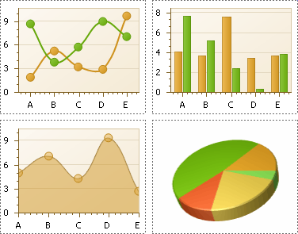
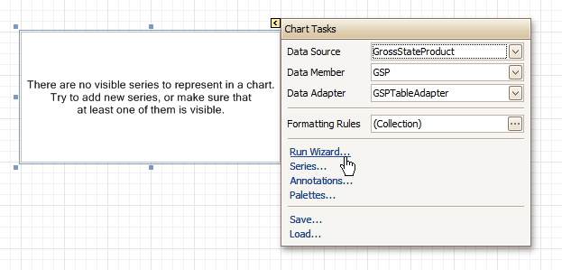
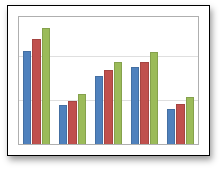

# Chart
The **Chart** is a sophisticated control used to embed graphs into your report. It graphically represents a _series_ of _points_ using numerous 2D or 3D chart types. A Chart can be populated with points both _manually_ (by specifying _arguments_ and _values_ for each point) and _dynamically_ (by connecting it to the report's data source, or binding it to a separate one).

For more information about this control, refer to [Charting](../../../../charting.md).

There are many available Chart types you can choose from. To name a few, these are Bar, Point, Line, Pie and Doughnut, Area, Radar and Polar, Range Bar, Gantt, Candle Stick and Stock charts.

A Chart control contains multiple elements (diagram, series, series points, axes, legend, titles, labels, strips, constant lines, etc.). When any of these elements is selected, the [Property Grid](../report-designer-ui/property-grid.md) shows only the properties which correspond to the selected item. Visual Chart elements which can be highlighted or selected, are described in [Highlighting and Selection Chart Elements](../../../../charting/highlighting-and-selection-chart-elements.md).

The Chart control is data-aware in a different manner than the other report controls. Consider three common report scenarios:
1. Static data for a Chart's series is provided _manually_. It can be done using the Series Collection Editor invoked by the Chart's Series property. It allows you to manually define values and arguments for each series point.
2. Chart's series are created _automatically_, getting their data from the Chart's Data Source and dependent on the rules defined by the Series Template property. This approach is described in [Chart with Dynamic Series](../../create-reports/report-types/chart-with-dynamic-series.md).
3. Each series is created and customized manually and has a separate Data Source. This approach is described in [Chart with Static Series](../../create-reports/report-types/chart-with-static-series.md).

You can customize a created chart using both the Property Grid and the [Chart Wizard](../../../../charting/chart-wizard.md). To invoke the Chart Wizard, click a Chart's [Smart Tag](../report-designer-ui/smart-tag.md), and in the invoked actions list, click the **Run Wizard...** link.

Then, the Chart Wizard will guide you through the whole process of customizing the Chart, from defining its view type to providing its data and customizing its appearance.

In the Property Grid, the Chart's properties are divided into the following groups.

## Appearance
* **Appearance Name**
	
	Allows you to choose one of the available appearances, to be used to draw the Chart's elements (Diagram, Axes, Legend, etc.).
* **Background Color**
	
	Specifies the background color for a Chart.
* **Background Image**
	
	Allows you to load a background image to a Chart (or define its URL), and also define whether it should be stretched to fit the entire Chart's area, or not.
* **Borders**, **Border Color**, **Border Dash Style** and **Border Width**
	
	Specify border settings for the control.
* **Fill Style**
	
	Determines the fill style of a Chart's background (Empty, Solid, Gradient or Hatch) and define other fill options if required.
* **Formatting Rules**
	
	Invokes the Formatting Rules Editor allowing you to choose which rules should be applied to the control during report generation, and define the precedence of the applied rules. To learn more on this, refer to [Conditionally Change a Control's Appearance](../../create-reports/styles-and-conditional-formatting/conditionally-change-a-controls-appearance.md).
* **Image Type**
	
	Determines whether a Chart should be internally rendered as a metafile in a report (in this case the quality of the rendered image is always good, but in particular cases some details of the control may be lost), or as a bitmap (in this case the quality of the rendered image is sometimes poor, but it allows a control to be drawn more precisely).
* **Indicators Palette Name**
	
	Specifies the palette that is used to paint all indicators that exist in a Chart.
* **Padding**
	
	Specifies the internal space between the Chart's content (the diagram and legend) and its edge, in pixels.
* **Palette Name**
	
	Allows you to choose one from the built-in palettes to be used to draw a Chart's series.
* **Palette's Base Color Number**
	
	Allows you to define an integer index determining the base color for the palette defined by the Chart's Palette Name property.
* **Style Priority**
	
	Allows you to define the priority of various style elements (such as background color, border color, etc.). For more information on style inheritance, refer to [Understanding Style Concepts](../../create-reports/styles-and-conditional-formatting/understanding-style-concepts.md).

## Behavior
* **Anchor Horizontally**
	
	Specifies the horizontal anchoring style of the control, so that after page rendering it stays attached to the left control, right control, or both. This property defines how a report control is resized to maintain the distance to the left and right edges of its container control.
* **Anchor Vertically**
	
	Specifies the vertical anchoring style of the control, so that after page rendering it stays attached to the top control, bottom control, or both.
* **Can Publish**
	
	Specifies whether or not a control is displayed in a printed or exported document.
* **Empty Chart Text**
	
	Specifies the text to be shown in the Chart, when it has no data to display.
* **Scripts**
	
	This property contains events, which you can handle by the required scripts. For more information on scripting, refer to [Handle Events via Scripts](../../create-reports/miscellaneous/handle-events-via-scripts.md).
* **Small Chart Text**
	
	Specifies the text to be shown in the Chart, when it's too small to fit the diagram.
* **Visible**
	
	Specifies whether a Chart should be visible in print preview.

## Data
* **(Data Bindings)**
	
	If the current report is [bound to data](../../create-reports/binding-a-report-to-data.md), this property allows you to bind some of a Chart's properties (Bookmark, Navigation URL and Tag) to a data field obtained from the report's data source, and to apply a [format string](../../report-editing-basics/change-value-formatting-of-report-elements.md) to it. For more information on this, refer to [Displaying Values from a Database (Binding Report Elements to Data)](../../report-editing-basics/displaying-values-from-a-database-(binding-report-elements-to-data).md).
* **Data Adapter**
	
	Determines a data adapter that will populate a Chart's data source which is assigned via the Data Source property. It is automatically set to the appropriate value, when the Data Member property is defined. To learn more on this, refer to [Chart with Static Series](../../create-reports/report-types/chart-with-static-series.md).
* **Data Member**
	
	Determines the data source member which supplies data to a Chart. To learn more on this, refer to [Chart with Static Series](../../create-reports/report-types/chart-with-static-series.md).
	
	> [!NOTE]
	> Usually, it is not necessary to specify the Data Member property when binding a Chart to data. This property should only be set directly if the dataset contains more than one table.
* **Data Source**
	
	Determines a Chart's data source. To learn more on this, refer to [Chart with Static Series](../../create-reports/report-types/chart-with-static-series.md).
* **Pivot Grid Data Source Options**
	
	Provides access to the layout settings of a Chart that is linked with a [Pivot Grid](pivot-grid.md).
* **Series Data Member**
	
	Determines the name of the data field whose values are used to automatically generate and populate a Chart's series. To learn more on this, refer to [Chart with Dynamic Series](../../create-reports/report-types/chart-with-dynamic-series.md).
	
	When Chart binding is used to automatically generate series within a chart control based upon the data obtained from the associated data source (defined by the Data Source property), a rule needs to be defined that helps the Chart recognize the data records whose values are used to construct individual series objects. To do this, the Series Data Member property, which specifies the data field whose values are taken into account when series objects are automatically created and populated, can be used.
	
	Each automatically generated series gets its name from the data field specified by the Series Data Member property. For example, this name is used to identify a series within the chart control's legend. The names of all automatically generated series can be supplemented with the same prefix and postfix defined by the settings which are available via the Series Name Template property.
	
	The template settings for the dynamically created series are defined by the specific properties which are available via the SeriesTemplate property of a Chart. In particular, the Argument Data Member and Value Data Members properties specify the data fields from which the arguments and data values of the series data points are obtained.
	
	> [!NOTE]
	> Note that if the Series Data Member property is not set for a Chart, the Chart control can't automatically generate series even if the Argument Data Member and Value Data Members properties are defined.
* **Series Name Template**
	
	Determines the settings used to name data bound series defining the prefix and postfix texts for the names of series which are dynamically created as a result of binding a Chart to data (using the Data Source, Series Data Member, Argument Data Member and Value Data Members properties). The series names, to which these prefixes and postfixes are added, are taken by each series from the data field defined by the Series Data Member property. To learn more on this, refer to [Chart with Dynamic Series](../../create-reports/report-types/chart-with-dynamic-series.md).
	
	> [!NOTE]
	> Note that the settings available via the Series Name Template property are not applied to the data bound series which are contained within the Series collection of a Chart.
* **Series Sorting**
	
	Allows you to define the sort mode of a Chart's series (None by default, Descending or Ascending).
* **Series Template**
	
	Allows you to customize a template for series which are created dynamically as a result of binding a Chart to data (via the Data Source and Series Data Member properties). The settings which are available via the Series Template property are common to all such data bound series. These settings allow you to provide centralized customization of all dynamically created data bound series. To learn more on using this property, refer to [Chart with Dynamic Series](../../create-reports/report-types/chart-with-dynamic-series.md).
	
	Note that the settings which are customized via the Series Template property don't apply to the series contained within the Series collection of a Chart.
* **Tag**
	
	This property allows you to add some additional information to the control; for example its id, by which it can then be accessible via [scripts](../../create-reports/miscellaneous/handle-events-via-scripts.md).
	
	If the current [report has a data source](../../create-reports/binding-a-report-to-data.md), the Tag property can be bound to a data field obtained from the data source. To do this, expand the (Data Bindings) property and in the Tag.Binding drop-down selector, select the required data field.

## Design
* **(Name)**
	
	Determines a control's name, by which it can be accessed in the [Report Explorer](../report-designer-ui/report-explorer.md), [Property Grid](../report-designer-ui/property-grid.md) or via [scripts](../../create-reports/miscellaneous/handle-events-via-scripts.md).

## Elements
* **Annotation Repository**
	
	Provides centralized access to all annotations that are present in the Chart.
* **Annotations**
	
	Provides access to the annotations collection of the Chart.
* **Diagram**
	
	Allows you to customize a Chart's diagram elements: main and secondary axes and panes.
	
	By default, a Chart is displayed in the Default Pane, but if necessary, you can display each Chart's series in a separate pane. To do this, click the Pane's ellipsis button, to invoke the Pane Collection Editor, allowing you to manage and customize panes. Then, select the required series within the Chart and set its View.Pane property to the required pane.
	
	Note that the diagram is null until no visible series exists in the Chart's collection. So, to access the diagram's options, you should create a series first.
* **Legend**
	
	Allows you to customize a Chart's legend, by defining such properties as text alignment and antialiasing, font style, background color or image, border options, markers' size and visibility, shadow options, etc.
* **Legends**
	
	Invokes the Legend Collection Editor, which allows you to manage and customize a Chart's additional legends.
* **Series**
	
	Invokes the Series Collection Editor, which allows you to manage and customize a Chart's series.
	
	Note that [series which are bound to data at the level of a chart control](../../create-reports/report-types/chart-with-dynamic-series.md) (in particular, using the Data Source, Series Data Member and both the Argument Data Member and Value Data Members properties) are created dynamically, based upon the data obtained from the specified data source, and they are not presented within the Series collection. To perform a centralized customization of such series, use the settings which are available via the Series Template property.
* **Titles**
	
	Invokes the Chart Title Collection Editor, which allows you to manage and customize a Chart's titles.

## Layout
* **Automatic Layout**
	
	Specifies whether the adaptive layout feature is enabled for chart elements. This feature is used to maintain a better chart appearance and layout when the chart becomes smaller.
	
	| Automatic Layout = Yes | Automatic Layout = No |
	|---|---|
	|  |  |
* **Location**
	
	Specifies the control's location, measured in [report units](../../create-reports/basic-operations/change-measurement-units-of-a-report.md).
* **Size**
	
	Specifies the control's size, measured in [report units](../../create-reports/basic-operations/change-measurement-units-of-a-report.md).
* **Snap Line Margin**
	
	Specifies the margin (measured in [report units](../../create-reports/basic-operations/change-measurement-units-of-a-report.md)), which is to be preserved around the control when it is [aligned using Snap Lines](../../create-reports/basic-operations/controls-positioning.md), or when other controls are aligned next to it.

## Navigation
* **Bookmark** and **Parent Bookmark**
	
	These properties are intended for the creation of a hierarchical structure within a report called a document map. For an explanation and help, refer to [Add Bookmarks](../../create-reports/report-navigation-and-interactivity/add-bookmarks.md).
	
	If the current [report has a data source](../../create-reports/binding-a-report-to-data.md), the Bookmark property can be bound to a data field obtained from the data source. To do this, expand the (Data Bindings) property and in the Bookmark.Binding drop-down selector, select the required data field.
* **Navigation URL** and **Navigation Target**
	
	Use the Navigation URL property to specify a URL for web browser navigation when a user clicks the control. The web browser displays a page in a window or a frame as specified by the Navigation Target property. Note that a URL should have an appropriate prefix (e.g. "http://"). You can create cross-references within the report by assigning the name of the target control to the Navigation URL property, and setting the Navigation Target property to "_self". For more information, refer to [Create Hyperlinks](../../create-reports/report-navigation-and-interactivity/create-hyperlinks.md).
	
	If the current [report has a data source](../../create-reports/binding-a-report-to-data.md), the Navigation URL property can be bound to a data field obtained from the data source. To do this, expand the (Data Bindings) property, and in the Navigation URL.Binding drop-down selector, select the required data field.