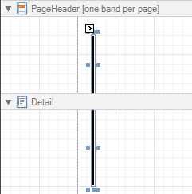

# Cross-band Line
The **Cross-band Line** control allows you to draw a line through several [bands](../report-bands.md). This can be useful if it is required to visually emphasize a section consisting of multiple band areas. In other aspects, it is similar to a regular [Line](line.md).

Another cross-band control available is the [Cross-band Box](cross-band-box.md).

In the [Property Grid](../report-designer-ui/property-grid.md), the Cross-band Line control's properties are divided into the following groups.

## Appearance
* **Foreground Color**
	
	Specifies the color of the control's line. This option is also available in the [Formatting Toolbar](../report-designer-ui/formatting-toolbar.md) ().
* **Line Style**
	
	You can select a solid (by default), dashed, dotted or mixed style for the line.

## Behavior
* **Anchor Horizontally**
	
	Specifies the horizontal anchoring style of the control, so that after page rendering it stays attached to the left control, right control, or both. This property defines how a report control is resized to maintain the distance to the left and right edges of its container control.
* **Anchor Vertically**
	
	Specifies the vertical anchoring style of the control, so that after page rendering it stays attached to the top control, bottom control, or both.
* **Can Publish**
	
	Specifies whether or not a report control is displayed in a printed or exported document.
* **Visible**
	
	Specifies whether the control should be visible in print preview.

## Data
* **Tag**
	
	This property allows you to add some additional information to the control; for example its id, by which it then can be accessible via [scripts](../../create-reports/miscellaneous/handle-events-via-scripts.md).

## Design
* **(Name)**
	
	Determines a control's name, by which it can be accessed in the [Report Explorer](../report-designer-ui/report-explorer.md), [Property Grid](../report-designer-ui/property-grid.md) or via [scripts](../../create-reports/miscellaneous/handle-events-via-scripts.md).

## Layout
* **End Band**
	
	Determines a band, in which the control finishes drawing.
* **End Point**
	
	Determines the end point (from a band's upper left corner) where the control finishes drawing.
* **Snap Line Margin**
	
	Specifies the margin (measured in [report units](../../create-reports/basic-operations/change-measurement-units-of-a-report.md)), which is to be preserved around the control when it is [aligned using Snap Lines](../../create-reports/basic-operations/controls-positioning.md), or when other controls are aligned next to it.
* **Start Band**
	
	Determines a band, in which the control starts drawing.
* **Start Point**
	
	Determines the starting point (from a band's upper left corner) where the control starts drawing.
* **Width**
	
	Specifies the line's width measured in [report units](../../create-reports/basic-operations/change-measurement-units-of-a-report.md).