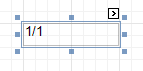

# Page Info
The **Page Info** control is intended to [add page numbers and system information](../../report-editing-basics/add-page-numbers-and-system-information-to-a-report.md) (the current date and time or the current user name) into your report. As with many other controls, you can [format](../../report-editing-basics/change-value-formatting-of-report-elements.md) this control's content.

In the [Property Grid](../report-designer-ui/property-grid.md), the Page Info control's properties are divided into the following groups.

## Appearance
* **Background Color**
	
	Specifies the background color for the control. This option is also available in the [Formatting Toolbar](../report-designer-ui/formatting-toolbar.md) ().
* **Borders**, **Border Color**, **Border Dash Style** and **Border Width**
	
	Specify border settings for the control.
* **Font**
	
	Specifies the font settings for the control. Some of these settings are available in the [Formatting Toolbar](../report-designer-ui/formatting-toolbar.md).
* **Foreground Color**
	
	Specifies the text color for the control. This option is also available in the [Formatting Toolbar](../report-designer-ui/formatting-toolbar.md) ().
* **Formatting Rules**
	
	Invokes the Formatting Rules Editor, allowing you to choose which rules should be applied to the control during report generation, and define the precedence of the applied rules. To learn more on this, refer to [Conditionally Change a Control's Appearance](../../create-reports/styles-and-conditional-formatting/conditionally-change-a-controls-appearance.md).
* **Padding**
	
	Specifies indent values which are used to render the contents of the control.
* **Style Priority**
	
	Allows you to define the priority of various style elements (such as background color, border color, etc.). For more information on style inheritance, refer to [Understanding Style Concepts](../../create-reports/styles-and-conditional-formatting/understanding-style-concepts.md).
* **Styles**
	
	Specifies [odd and even styles](../../create-reports/styles-and-conditional-formatting/use-odd-and-even-styles.md) for the control and enables you to assign an existing style to the control (or a newly created one). To learn more, see [Understanding Style Concepts](../../create-reports/styles-and-conditional-formatting/understanding-style-concepts.md).
* **Text Alignment**
	
	Allows you to change the alignment of the control's text. This option is also available in the [Formatting Toolbar](../report-designer-ui/formatting-toolbar.md).

## Behavior
* **Anchor Horizontally**
	
	Specifies the horizontal anchoring style of the control, so that after page rendering it stays attached to the left control, right control, or both. This property defines how a report control is resized to maintain the distance to the left and right edges of its container control.
* **Anchor Vertically**
	
	Specifies the vertical anchoring style of the control, so that after page rendering it stays attached to the top control, bottom control, or both.
* **Can Publish**
	
	Specifies whether or not a report control is displayed in a printed or exported document.
* **Format**
	
	This property allows you to specify the format string for the text displayed in the control. When you click the ellipsis button, you will see the **Format String Editor** window that will select the predefined format or customize it as needed. For more information about this, refer to [Change Value Formatting of Report Elements](../../report-editing-basics/change-value-formatting-of-report-elements.md).
* **Page Information**
	
	You can select the type of information displayed in the control.

| Type | Description |
|---|---|
| **None** | Displays an empty control. |
| **Page Number** | The string, specified by the **Format** property, is displayed. The **{0}** combination in the string is replaced with the current page number. |
| **"Current of Total" Page Numbers** | The string, specified by the **Format** property, is displayed. The **{0}** combination in the string is replaced with the current page number, the **{1}** combination - with a total number of pages in the report. To display the typical "Page 1 of 11"  text, use the format string "Page {0} of {1}". |
| **Page Number (Roman, Lowercase)** | The current page number is displayed using Roman numerals in lowercase. |
| **Page Number (Roman, Uppercase)** | The current page number is displayed using Roman numerals in uppercase. |
| **Current Date and Time** | The string, specified by the **Format** property, is displayed. The **{0:[format]}** combination is replaced with the current system date and time formatted according to the **[format]** string. Use the **Format String Editor** of the **Format** property (see below) to select or construct the proper string. |
| **User Name** | The name of the current user, which was used to log into the operating system, is displayed. |
* **Running Band**
	
	Specifies the name of the [band](../report-bands.md), from which the Page Info gathers information. This allows you to implement [page numbering](../../report-editing-basics/add-page-numbers-and-system-information-to-a-report.md) independently for the report and its groups. For a tutorial on this, refer to [Add Page Numbers for Groups](../../create-reports/miscellaneous/add-page-numbers-for-groups.md).
	
	By default, this property is not set to any value, meaning that the entire report is being taken into account.
* **Scripts**
	
	This property contains events, which you can handle with the required scripts. For more information on scripting, refer to [Handle Events via Scripts](../../create-reports/miscellaneous/handle-events-via-scripts.md).
* **Start Page Number**
	
	Here you can set the start number for page numbering.
* **Visible**
	
	Specifies whether the control should be visible in print preview.
* **Word Wrap**
	
	When this property is set to Yes, text contained in the control is wrapped to the next line if it doesn't fit the line or comes across a newline character. If the this property is set to No, the text in this case will be displayed on the same line until a newline character is entered.

## Data
* **(Data Bindings)**
	
	If the current report is [bound to data](../../create-reports/binding-a-report-to-data.md), this property allows you to bind some of the control's properties (Bookmark, Navigation URL and Tag) to a data field obtained from the report's data source, and to apply a [format string](../../report-editing-basics/change-value-formatting-of-report-elements.md) to it. For more information on this, refer to [Displaying Values from a Database (Binding Report Elements to Data)](../../report-editing-basics/displaying-values-from-a-database-(binding-report-elements-to-data).md).
* **Tag**
	
	This property allows you to add some additional information to the control; for example its id, by which it can be then accessible via [scripts](../../create-reports/miscellaneous/handle-events-via-scripts.md).
	
	If the current [report has a data source](../../create-reports/binding-a-report-to-data.md), the Tag property can be bound to a data field obtained from the data source. To do this, expand the (Data Bindings) property and in the Tag.Binding drop-down selector, select the required data field.

## Design
* **(Name)**
	
	Determines a control's name, by which it can be accessed in the [Report Explorer](../report-designer-ui/report-explorer.md), [Property Grid](../report-designer-ui/property-grid.md) or via [scripts](../../create-reports/miscellaneous/handle-events-via-scripts.md).

## Layout
* **Location**
	
	Specifies the control's location, measured in [report units](../../create-reports/basic-operations/change-measurement-units-of-a-report.md).
* **Size**
	
	Specifies the control's size, measured in [report units](../../create-reports/basic-operations/change-measurement-units-of-a-report.md).
* **Snap Line Margin**
	
	Specifies the margin (measured in [report units](../../create-reports/basic-operations/change-measurement-units-of-a-report.md)), which is to be preserved around the control when it is [aligned using Snap Lines](../../create-reports/basic-operations/controls-positioning.md), or when other controls are aligned next to it.

## Navigation
* **Bookmark** and **Parent Bookmark**
	
	These properties are intended for the creation of a hierarchical structure within a report called a document map. For an explanation and help, refer to [Add Bookmarks](../../create-reports/report-navigation-and-interactivity/add-bookmarks.md).
	
	If the current [report has a data source](../../create-reports/binding-a-report-to-data.md), the Bookmark property can be bound to a data field obtained from the data source. To do this, expand the (Data Bindings) property and in the Bookmark.Binding drop-down selector, select the required data field.
* **Navigation URL** and **Navigation Target**
	
	Use the Navigation URL property to specify a URL for web browser navigation when a user clicks the control. The web browser displays a page in a window or a frame as specified by the Navigation Target property. Note that a URL should have an appropriate prefix (e.g. "http://"). You can create cross-references within the report by assigning the name of the target control to the Navigation URL property, and setting the Navigation Target property to "_self". For more information, refer to [Create Hyperlinks](../../create-reports/report-navigation-and-interactivity/create-hyperlinks.md).
	
	If the current [report has a data source](../../create-reports/binding-a-report-to-data.md), the Navigation URL property can be bound to a data field obtained from the data source. To do this, expand the (Data Bindings) property and in the Navigation URL.Binding drop-down selector, select the required data field.

## Printing
* **Right to Left**
	
	Specifies the direction of text within a control. Use this option to correctly render text written in right-to-left languages.
	
	By default, all report controls have this property set to Inherit, so enabling it for a report will apply this setting to all its controls.
	
	The right-to-left layout is preserved when [exporting a report](../../../../print-preview/print-preview-for-winforms/exporting/exporting-from-print-preview.md) to any of the supported formats (e.g., PDF, Excel, or RTF).