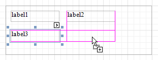

# Panel
The **Panel** control is a container that frames separate report controls to allow them to be easily moved, copied and pasted, and visually unite them in the report's preview (with borders or a uniform color background).

Currently, there are several limitations on Panel usage. One of them is that Panel cannot shrink, and therefore cannot suppress the white space that appears when the controls inside are shrunk or collapsed. Also, the Panel cannot cross [bands](../report-bands.md), as [Cross-band Line](cross-band-line.md) and [Cross-band Box](cross-band-box.md) can do.

In the [Property Grid](../report-designer-ui/property-grid.md), the Panel's properties are divided into the following groups.

## Appearance
* **Background Color**
	
	Specifies the background color for the control.
* **Borders**, **Border Color**, **Border Dash Style** and **Border Width**
	
	Specify border settings for the control.
* **Formatting Rules**
	
	Invokes the Formatting Rules Editor allowing you to choose which rules should be applied to the control during report generation, and define the precedence of the applied rules. To learn more on this, refer to [Conditionally Change a Control's Appearance](../../create-reports/styles-and-conditional-formatting/conditionally-change-a-controls-appearance.md).
* **Padding**
	
	Specifies indent values which are used to render the contents of controls contained in a Panel.
* **Style Priority**
	
	Allows you to define the priority of various style elements (such as background color, border color, etc.). For more information on style inheritance, refer to [Understanding Style Concepts](../../create-reports/styles-and-conditional-formatting/understanding-style-concepts.md).
* **Styles**
	
	Specifies [odd and even styles](../../create-reports/styles-and-conditional-formatting/use-odd-and-even-styles.md) for the control and enables you to assign an existing style to the control (or a newly created one). To learn more, see [Understanding Style Concepts](../../create-reports/styles-and-conditional-formatting/understanding-style-concepts.md).

## Behavior
* **Anchor Horizontally**
	
	Specifies the horizontal anchoring style of the control, so that after page rendering it stays attached to the left control, right control, or both. This property defines how a report control is resized to maintain the distance to the left and right edges of its container control.
* **Anchor Vertically**
	
	Specifies the vertical anchoring style of the control, so that after page rendering it stays attached to the top control, bottom control, or both.
	
	Note that if the Anchor Vertically property is set to Bottom or Both, the Can Grow property (see below) values are ignored, and don't participate in calculating a final height value of this control.
* **Can Grow**
	
	When this property is set to Yes, the control's height can be automatically increased, if required, to display the text. If there are other controls below the current control, they will be pushed down to prevent them from overlapping. Note that if a control overlaps the growing Panel by even one pixel, it will not be pushed down by the growing Panel.
* **Can Publish**
	
	Specifies whether or not a report control is displayed in a printed or exported document.
* **Keep Together**
	
	Specifies whether the contents of the control can be horizontally split across pages. In other words, if the control occupies more space than remains on the page, this property specifies whether this control should be split between the current page and the next, or whether it will be printed entirely on the next page. This property is in effect only when the control's content does not fit on the current page. If it does not fit on the next page either, then the control will be split despite this property's value.
* **Scripts**
	
	This property contains events, which you can handle with the required scripts. For more information on scripting, refer to [Handle Events via Scripts](../../create-reports/miscellaneous/handle-events-via-scripts.md).
* **Visible**
	
	Specifies whether the control should be visible in print preview.

## Data
* **(Data Bindings)**
	
	If the current report is [bound to data](../../create-reports/binding-a-report-to-data.md), this property allows you to bind some of the control's properties (Bookmark, Navigation URL and Tag) to a data field obtained from the report's data source, and to apply a [format string](../../report-editing-basics/change-value-formatting-of-report-elements.md) to it. For more information on this, refer to [Displaying Values from a Database (Binding Report Elements to Data)](../../report-editing-basics/displaying-values-from-a-database-(binding-report-elements-to-data).md).
* **Tag**
	
	This property allows you to add some additional information to the control; for example its id, by which it can then be accessible via [scripts](../../create-reports/miscellaneous/handle-events-via-scripts.md).
	
	If the current [report has a data source](../../create-reports/binding-a-report-to-data.md), the Tag property can be bound to a data field obtained from the data source. To do this, expand the (Data Bindings) property and in the Tag.Binding drop-down selector, select the required data field.

## Design
* **(Name)**
	
	Determines a control's name, by which it can be accessed in the [Report Explorer](../report-designer-ui/report-explorer.md), [Property Grid](../report-designer-ui/property-grid.md) or via [scripts](../../create-reports/miscellaneous/handle-events-via-scripts.md).

## Layout
* **Location**
	
	Specifies the control's location, measured in [report units](../../create-reports/basic-operations/change-measurement-units-of-a-report.md).
* **Size**
	
	Specifies the control's size, measured in [report units](../../create-reports/basic-operations/change-measurement-units-of-a-report.md).
* **Snap Line Margin**
	
	Specifies the margin (measured in [report units](../../create-reports/basic-operations/change-measurement-units-of-a-report.md)), which is to be preserved around the control when it is [aligned using Snap Lines](../../create-reports/basic-operations/controls-positioning.md), or when other controls are aligned next to it.
* **Snap Line Padding**
	
	Specifies the padding (measured in [report units](../../create-reports/basic-operations/change-measurement-units-of-a-report.md)), which is to be preserved within the control when controls it contains are [aligned using Snap Lines](../../create-reports/basic-operations/controls-positioning.md).

## Navigation
* **Bookmark** and **Parent Bookmark**
	
	These properties are intended for the creation of a hierarchical structure within a report called a document map. For an explanation and help, refer to [Add Bookmarks](../../create-reports/report-navigation-and-interactivity/add-bookmarks.md).
	
	If the current [report has a data source](../../create-reports/binding-a-report-to-data.md), the Bookmark property can be bound to a data field obtained from the data source. To do this, expand the (Data Bindings) property and in the Bookmark.Binding drop-down selector, select the required data field.
* **Navigation URL** and **Navigation Target**
	
	Use the Navigation URL property to specify a URL for web browser navigation when a user clicks the control. The web browser displays a page in a window or a frame as specified by the Navigation Target property. Note that a URL should have an appropriate prefix (e.g. "http://"). You can create cross-references within the report by assigning the name of the target control to the Navigation URL property, and setting the Navigation Target property to "_self". For more information, refer to [Create Hyperlinks](../../create-reports/report-navigation-and-interactivity/create-hyperlinks.md).
	
	If the current [report has a data source](../../create-reports/binding-a-report-to-data.md), the Navigation URL property can be bound to a data field obtained from the data source. To do this, expand the (Data Bindings) property and in the Navigation URL.Binding drop-down selector, select the required data field.

## Printing
* **Right to Left**
	
	Specifies the direction of text within controls contained in a panel. Use this option to correctly render text written in right-to-left languages.
	
	By default, all report controls have this property set to Inherit, so enabling it for a report will apply this setting to all its controls.
	
	The right-to-left layout is preserved when [exporting a report](../../../../print-preview/print-preview-for-winforms/exporting/exporting-from-print-preview.md) to any of the supported formats (e.g., PDF, Excel, or RTF).