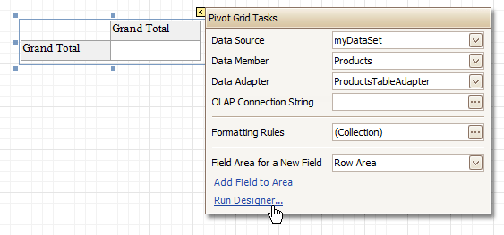

# Pivot Grid
The **Pivot Grid** control represents dynamic data (obtained from an underlying data source) in a cross-tabulated form to create [cross-tab reports](../../create-reports/report-types/cross-tab-report.md), similar to Pivot Tables in Microsoft Excel&#174;. Column headers display unique values from one data field, and row headers - from another field. Each cell displays a summary for the corresponding row and column values. By specifying different data fields, you can see different totals. This allows you to get a compact layout for a complex data analysis.

The Pivot Grid has a designer which allows you to easily adjust its layout. It can be invoked using the control's [Smart Tag](../report-designer-ui/smart-tag.md).

For more information on using this control, refer to [Pivot Table](../../../../pivot-table.md).

In the [Property Grid](../report-designer-ui/property-grid.md), the Pivot Grid's properties are divided into the following groups.

## Appearance
* **Appearance**
	
	Allows you to define the appearance properties (such as Background Color, Foreground Color, Font, etc.) for the Pivot Grid's elements (Cell, Field Value, Filter Separator, Header Group Line, etc.).
* **Formatting Rules**
	
	Invokes the Formatting Rules Editor allowing you to choose which rules should be applied to the control during report generation, and define the precedence of the applied rules. To learn more on this, refer to [Conditionally Change a Control's Appearance](../../create-reports/styles-and-conditional-formatting/conditionally-change-a-controls-appearance.md).
* **Styles**
	
	Allows you to invoke the Styles Editor, which is intended to manage and customize the control's styles, which then can be assigned to the Pivot Grid's elements.

## Behavior
* **Anchor Horizontally**
	
	Specifies the horizontal anchoring style of the control, so that after page rendering it stays attached to the left control, right control, or both. This property defines how a report control is resized to maintain the distance to the left and right edges of its container control.
* **Anchor Vertically**
	
	Specifies the vertical anchoring style of the Pivot Grid, so that after page rendering it stays attached to the top control, bottom control, or both.
* **Keep Together**
	
	Specifies whether the contents of the control can be horizontally split across pages. In other words, if the control occupies more space than remains on the page, this property specifies whether this Pivot Grid should be split between the current page and the next, or whether it will be printed entirely on the next page. This property is in effect only when a Pivot Grid's content does not fit on the current page. If it does not fit on the next page either, then the Pivot Grid will be split despite this property's value.
* **Scripts**
	
	This property contains events, which you can handle by the required scripts. For more information on scripting, refer to [Handle Events via Scripts](../../create-reports/miscellaneous/handle-events-via-scripts.md).
* **Visible**
	
	Specifies whether the control should be visible in print preview.

## Data
* **Data Adapter**
	
	Determines a data adapter that will populate a Pivot Grid's data source which is assigned via the Data Source property. It is automatically set to the appropriate value, when the Data Member property is defined. To learn more on this, refer to [Cross-Tab Report](../../create-reports/report-types/cross-tab-report.md).
* **Data Member**
	
	Determines the data source member which supplies data to a Pivot Grid. To learn more on this, refer to [Cross-Tab Report](../../create-reports/report-types/cross-tab-report.md).
	
	> [!NOTE]
	> Usually, it is not necessary to specify the Data Member property when binding a Pivot Grid to data. This property should only be set directly if the dataset contains more than one table.
* **Data Source**
	
	Determines a Pivot Grid's data source. To learn more on this, refer to [Cross-Tab Report](../../create-reports/report-types/cross-tab-report.md).
* **Fields**
	
	Invokes the Pivot Grid Field Collection Editor, allowing you to manage and fully customize a Pivot Grid's fields.
* **OLAP Connection String**
	
	Specifies a connection string to a cube in an Microsoft Analysis Services database. A sample connection string is shown below:
	
	``OLAPConnectionString="Provider=msolap;Data Source=localhost;Initial Catalog=Adventure Works DW;Cube Name=Adventure Works;Query Timeout=100;"``
	
	A connection string can be built via the Connection String Editor. To invoke it, click the ellipsis button for the OLAP Connection String property.
	
	To represent information from the bound cube, create specific Pivot Grid fields, and bind them to the required fields in the data source.
	
	If the OLAP Connection String property is set to a valid string, the value of the Data Source property is cleared. Setting the Data Source property to a valid object clears the OLAP Connection String property.
* **OLAP Data Provider**
	
	A Pivot Grid can use one of the following data providers to communicate with the Microsoft Analysis Services server.
	* OLE DB for OLAP
		
		Provides basic OLAP binding capabilities.
	* ADOMD.NET
		
		Offers certain performance gains when compared to OLE DB, and yet allows you to retrieve OLAP member format strings and properties from the server.
	* XMLA
		
		An open XML-based standard that does not require any data access libraries or data providers to be installed on the client system. Nevertheless, it supports all OLAP features available in OLE DB and ADOMD.NET.
	
	The default data provider for Pivot Grid is OLE DB.
* **Prefilter**
	
	When this property is expanded in the [Property Grid](../report-designer-ui/property-grid.md), you can set its Enabled property to Yes, and use the Criteria property to invoke the Pivot Grid Prefilter dialog.
	
	This dialog allows you to build complex filter criteria with an unlimited number of filter conditions, combined by logical operators. It provides a set of logical operators that significantly simplify the process of creating filters for text, numeric and date-time fields.
	
	> [!NOTE]
	> The Prefilter is not supported in OLAP mode.
* **Tag**
	
	This property allows you to add some additional information to the control; for example its id, by which it can then be accessible via [scripts](../../create-reports/miscellaneous/handle-events-via-scripts.md).

## Design
* **(Name)**
	
	Determines a control's name, by which it can be accessed in the [Report Explorer](../report-designer-ui/report-explorer.md), [Property Grid](../report-designer-ui/property-grid.md) or via [scripts](../../create-reports/miscellaneous/handle-events-via-scripts.md).

## Layout
* **Location**
	
	Specifies the control's location, measured in [report units](../../create-reports/basic-operations/change-measurement-units-of-a-report.md).
* **Size**
	
	Specifies the control's size, measured in [report units](../../create-reports/basic-operations/change-measurement-units-of-a-report.md).
* **Snap Line Margin**
	
	Specifies the margin (measured in [report units](../../create-reports/basic-operations/change-measurement-units-of-a-report.md)), which is to be preserved around the control when it is [aligned using Snap Lines](../../create-reports/basic-operations/controls-positioning.md), or when other controls are aligned next to it.

## Navigation
* **Bookmark** and **Parent Bookmark**
	
	These properties are intended for the creation of a hierarchical structure within a report called a document map. For an explanation and help, refer to [Add Bookmarks](../../create-reports/report-navigation-and-interactivity/add-bookmarks.md).

## Options
* **Data Field Options**
	
	Allows you to customize the options which control the presentation of the data fields.
* **Data Options**
	
	Allows you to define whether a Pivot Grid's fields must be case sensitive or not.
* **Options Chart Data Source**
	
	Provides access to the options controlling the display of the Pivot Grid's data in a [Chart](chart.md).
* **Print Options**
	
	Allows you to customize the print options of a Pivot Grid.
* **View Options**
	
	Allows you to customize the Pivot Grid's display options.

## Printing
* **Right to Left**
	
	Specifies the orientation of the content within the Pivot Grid's cells. Use this option to correctly render text written in right-to-left languages.
	
	By default, all report controls have this property set to Inherit, so enabling it for a report will apply this setting to all its controls.
	
	The right-to-left layout is preserved when [exporting a report](../../../../print-preview/print-preview-for-winforms/exporting/exporting-from-print-preview.md) to any of the supported formats (e.g., PDF, Excel, or RTF).