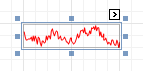

# Sparkline
The **Sparkline** control displays a compact chart that is commonly used to reflect the flow of data for every row in a report.

In the [Property Grid](../report-designer-ui/property-grid.md), the Sparkline control's properties are divided into the following groups.

## Appearance
* **Background Color**
	
	Specifies the background color for the control. This option is also available in the [Formatting Toolbar](../report-designer-ui/formatting-toolbar.md) ().
* **Borders**, **Border Color**, **Border Width**, and **Border Dash Style**
	
	Specify border settings for the control.
* **Formatting Rules**
	
	Invokes the Formatting Rules Editor, which allows you to choose which rules should be applied to a control during report generation, and define the precedence of the applied rules. To learn more on this, refer to [Conditionally Change a Control's Appearance](../../create-reports/styles-and-conditional-formatting/conditionally-change-a-controls-appearance.md).
* **Image Type**
	
	Determines whether a Sparkline should be internally rendered as a metafile in a report (in this case the quality of the rendered image is always good, but in particular cases some details of the control may be lost), or as a bitmap (in this case the quality of the rendered image is sometimes poor, but it allows a control to be drawn more precisely).
* **Padding**
	
	Specifies indent values that are used to render the contents of a Label.
* **Style Priority**
	
	Specifies the priority of various style elements (such as background color, border color, etc.). For more information on style inheritance, refer to [Understanding Style Concepts](../../create-reports/styles-and-conditional-formatting/understanding-style-concepts.md).
* **Styles**
	
	Specifies [odd and even styles](../../create-reports/styles-and-conditional-formatting/use-odd-and-even-styles.md) for the control and enables you to assign an existing style to the control (or a newly created one). To learn more, see [Understanding Style Concepts](../../create-reports/styles-and-conditional-formatting/understanding-style-concepts.md).
* **View**
	
	Specifies the type of a chart displayed by a Sparkline control. The following table lists the available Sparkline view types.
	
	| Line | Area | Bar | WinLoss |
	|---|---|---|---|
	|  |  |  |  |

## Behavior
* **Anchor Horizontally**
	
	Specifies the horizontal anchoring style of the control, so that after page rendering it stays attached to the left control, right control, or both. This property defines how a report control is resized to maintain the distance to the left and right edges of its container control.
* **Anchor Vertically**
	
	Specifies the vertical anchor style of the control, so that after a page is rendered it stays attached to the top control, bottom control, or both.
* **Can Publish**
	
	Specifies whether or not a report control is displayed in a printed or exported document.
* **Scripts**
	
	This property contains events that you can handle with the required scripts. For more information on scripting, refer to [Handle Events via Scripts](../../create-reports/miscellaneous/handle-events-via-scripts.md).
* **Visible**
	
	Specifies whether the control should be visible in a print preview.

## Data
* **(Data Bindings)**
	
	If the current report is [bound to data](../../create-reports/binding-a-report-to-data.md), this property allows you to bind some of the control's properties (Bookmark, Navigation URL and Tag) to a data field obtained from the report's data source, and to apply a [format string](../../report-editing-basics/change-value-formatting-of-report-elements.md) to it. For more information on this, refer to [Displaying Values from a Database (Binding Report Elements to Data)](../../report-editing-basics/displaying-values-from-a-database-(binding-report-elements-to-data).md).
* **Data Adapter**
	
	Determines the data adapter that will populate the Sparkline's data source, which is assigned via the Data Source property. It is automatically set to the appropriate value when the Data Member property is defined.
* **Data Member**
	
	Determines the data source member that supplies data to a Sparkline.
	
	> [!NOTE]
	> Usually, it is not necessary to specify the Data Member property when binding a Sparkline to data. This property should only be set directly if the dataset contains more than one table.
* **Data Source**
	
	Determines a Sparkline's data source.
* **Tag**
	
	This property allows you to add some additional information to the control; for example its id, by which it can then be accessible via [scripts](../../create-reports/miscellaneous/handle-events-via-scripts.md).
	
	If the current report [has a data source](../../create-reports/binding-a-report-to-data.md), the Tag property can be bound to a data field obtained from the data source. To do this, expand the (Data Bindings) property, and in the Tag.Binding drop-down selector, select the required data field.
* **Value Member**
	
	Specifies the data member field that provides point values for a Sparkline.
* **Value Range**
	
	Specifies a range of values displayed by a Sparkline.

## Design
* **(Name)**
	
	Determines the control's name by which it can be accessed in the [Report Explorer](../report-designer-ui/report-explorer.md), [Property Grid](../report-designer-ui/property-grid.md) or via [scripts](../../create-reports/miscellaneous/handle-events-via-scripts.md).

## Layout
* **Location**
	
	Specifies the control's location measured in [report units](../../create-reports/basic-operations/change-measurement-units-of-a-report.md).
* **Size**
	
	Specifies the control's size measured in [report units](../../create-reports/basic-operations/change-measurement-units-of-a-report.md).
* **Snap Line Margin**
	
	Specifies the margin (measured in [report units](../../create-reports/basic-operations/change-measurement-units-of-a-report.md)) around the control when it is [aligned using Snap Lines](../../create-reports/basic-operations/controls-positioning.md), or when other controls are aligned next to it.

## Navigation
* **Bookmark** and **Parent Bookmark**
	
	These properties are intended for the creation of a hierarchical structure within a report called a [document map](../../../../print-preview/print-preview-for-winforms/viewing-and-navigating/navigate-in-print-preview-using-bookmarks.md). For more information, refer to the [Add Bookmarks](../../create-reports/report-navigation-and-interactivity/add-bookmarks.md) topic.
	
	If the current report is [bound to a data source](../../create-reports/binding-a-report-to-data.md), the **Bookmark** property can be bound to a data field obtained from the data source. To do this, expand the **(Data Bindings)** property, and in the **Bookmark.Binding** drop-down selector, select the required data field.
* **Navigation URL** and **Navigation Target**
	
	Use the Navigation URL property to specify a URL for web browser navigation when a user clicks a Label. The web browser displays a page in a window or a frame as specified by the **Navigation Target** property. Note that a URL should have an appropriate prefix (e.g., "http://"). You can create cross-references within the report by assigning the name of the target control to the Navigation URL property, and setting the Navigation Target property to "_self". For more information, refer to [Create Hyperlinks](../../create-reports/report-navigation-and-interactivity/create-hyperlinks.md).
	
	If the current report is [bound to a data source](../../create-reports/binding-a-report-to-data.md), the Navigation URL property can be bound to a data field obtained from the data source. To do this, expand the (Data Bindings) property, and in the Navigation URL.Binding drop-down selector, select the required data field.