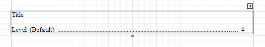

# Table of Contents
The **Table of Contents** control generates a table of contents based on bookmarks specified for report elements.

When a **Table of Contents** control is dropped onto a report's body from the [Toolbox](../report-designer-ui/control-toolbox.md), it is placed on the [Report Header](../report-bands.md) band of the report. If there is no Report Header in the report, it is created automatically.

A table of contents is generated based on the hierarchy of report bookmarks. To learn how to provide a report with bookmarks, refer to the [Add Bookmarks](../../create-reports/report-navigation-and-interactivity/add-bookmarks.md) topic.

In the [Property Grid](../report-designer-ui/property-grid.md), the properties of the **Table of Contents** are divided into the following groups.

## Appearance
* **Background Color**
	
	Specifies the background color for the control. This option is also available in the [Formatting Toolbar](../report-designer-ui/formatting-toolbar.md) ().
* **Borders**, **Border Color**, **Border Width** and **Border Dash Style**
	
	Specify border settings for the control.
* **Foreground Color**
	
	Specifies the text color for the control. This option is also available in the [Formatting Toolbar](../report-designer-ui/formatting-toolbar.md) ().
* **Padding**
	
	Specifies indent values that are used to render the contents of a Label.
* **Style Priority**
	
	Specifies the priority of various style elements (such as background color, border color, etc.). For more information on style inheritance, refer to [Understanding Style Concepts](../../create-reports/styles-and-conditional-formatting/understanding-style-concepts.md).
* **Styles**
	
	Specifies [odd and even styles](../../create-reports/styles-and-conditional-formatting/use-odd-and-even-styles.md) for the control and enables you to assign an existing style to the control (or a newly created one). To learn more, see [Understanding Style Concepts](../../create-reports/styles-and-conditional-formatting/understanding-style-concepts.md).

## Behavior
* **Level Default**
	
	Specifies the default formatting options for the hierarchical levels of a **Table of Contents**.
* **Level Title**
	
	Specifies the formatting options for the title of a **Table of Contents**.
* **Levels**
	
	Invokes the **Table of Contents Level Collection Editor**, which allows you to edit and customize formatting options for hierarchical levels of a **Table of Contents**.
* **Max Nesting Level**
	
	Specifies the maximum number of **Table of Contents** levels to be displayed. If set to **0**, no limitation is applied.
* **Visible**
	
	Specifies whether the control should be visible in a print preview.

## Data
* **Tag**
	
	This property allows you to add some additional information to the control; for example, its id, by which it can then be accessible using [scripts](../../create-reports/miscellaneous/handle-events-via-scripts.md).

## Design
* **(Name)**
	
	Determines the control's name by which it can be accessed in the [Report Explorer](../report-designer-ui/report-explorer.md), [Property Grid](../report-designer-ui/property-grid.md) or using [scripts](../../create-reports/miscellaneous/handle-events-via-scripts.md).

## Layout
* **Location**
	
	Specifies the control's location measured in [report units](../../create-reports/basic-operations/change-measurement-units-of-a-report.md).

## Printing
* **Right to Left**
	
	Specifies the orientation of the control's content. Use this option to correctly render text written in right-to-left languages.
	
	By default, all report controls have this property set to Inherit, so enabling it for a report will apply this setting to all its controls.
	
	The right-to-left layout is preserved when [exporting a report](../../../../print-preview/print-preview-for-winforms/exporting/exporting-from-print-preview.md) to any of the supported formats (e.g., PDF, Excel, or RTF).