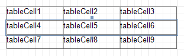

The **Table Row Control** represents a single row within a [Table](../../../../../../interface-elements-for-desktop/articles/report-designer/report-designer-for-winforms/report-designer-reference/report-controls/table.md).

This control is useful for changing the layout of the entire row. Although in this document, a Row is described as a separate control, in fact most of its properties are actually applied to the [Cells](../../../../../../interface-elements-for-desktop/articles/report-designer/report-designer-for-winforms/report-designer-reference/report-controls/table-cell.md) contained within the selected row.

In the [Property Grid](../../../../../../interface-elements-for-desktop/articles/report-designer/report-designer-for-winforms/report-designer-reference/report-designer-ui/property-grid.md), the Table Row's properties are divided into the following groups.

## Appearance
* **Background Color**
	
	Specifies the background color for the control. This option is also available in the [Formatting Toolbar](../../../../../../interface-elements-for-desktop/articles/report-designer/report-designer-for-winforms/report-designer-reference/report-designer-ui/formatting-toolbar.md) ().
* **Borders**, **Border Color**, **Border Dash Style** and **Border Width**
	
	Specify border settings for the control.
* **Font**
	
	Specifies the font settings for the control. Some of these settings are available in the [Formatting Toolbar](../../../../../../interface-elements-for-desktop/articles/report-designer/report-designer-for-winforms/report-designer-reference/report-designer-ui/formatting-toolbar.md).
* **Foreground Color**
	
	Specifies the text color for the control. This option is also available in the [Formatting Toolbar](../../../../../../interface-elements-for-desktop/articles/report-designer/report-designer-for-winforms/report-designer-reference/report-designer-ui/formatting-toolbar.md) ().
* **Formatting Rules**
	
	Invokes the Formatting Rules Editor, allowing you to choose which rules should be applied to the control during report generation, and define the precedence of the applied rules. To learn more on this, refer to [Conditionally Change a Control's Appearance](../../../../../../interface-elements-for-desktop/articles/report-designer/report-designer-for-winforms/create-reports/styles-and-conditional-formatting/conditionally-change-a-control's-appearance.md).
* **Padding**
	
	Specifies indent values which are used to render the contents of a Row.
* **Style Priority**
	
	Allows you to define the priority of various style elements (such as background color, border color, etc.). For more information on style inheritance, refer to [Understanding Style Concepts](../../../../../../interface-elements-for-desktop/articles/report-designer/report-designer-for-winforms/create-reports/styles-and-conditional-formatting/understanding-style-concepts.md).
* **Styles**
	
	Specifies [odd and even styles](../../../../../../interface-elements-for-desktop/articles/report-designer/report-designer-for-winforms/create-reports/styles-and-conditional-formatting/use-odd-and-even-styles.md) for the control and enables you to assign an existing style to the control (or a newly created one). To learn more, see [Understanding Style Concepts](../../../../../../interface-elements-for-desktop/articles/report-designer/report-designer-for-winforms/create-reports/styles-and-conditional-formatting/understanding-style-concepts.md).
* **Text Alignment**
	
	Allows you to change the alignment of the control's text. This option is also available in the [Formatting Toolbar](../../../../../../interface-elements-for-desktop/articles/report-designer/report-designer-for-winforms/report-designer-reference/report-designer-ui/formatting-toolbar.md).

## Behavior
* **Can Publish**
	
	Specifies whether or not a report control is displayed in a printed or exported document.
* **Keep Together**
	
	Specifies whether the contents of a Row can be horizontally split across pages. In other words, if a Row occupies more space than remains on the page, this property specifies whether this Row should be split between the current page and the next, or whether it will be printed entirely on the next page. This property is in effect only when a Row's content does not fit on the current page. If it does not fit on the next page either, then the Row will be split despite this property's value.
* **Scripts**
	
	This property contains events, which you can handle with the required scripts. For more information on scripting, refer to [Handle Events via Scripts](../../../../../../interface-elements-for-desktop/articles/report-designer/report-designer-for-winforms/create-reports/miscellaneous/handle-events-via-scripts.md).
* **Visible**
	
	Specifies whether the control should be visible in print preview.

## Data
* **Tag**
	
	This property allows you to add some additional information to the control; for example its id, by which it can then be accessible via [scripts](../../../../../../interface-elements-for-desktop/articles/report-designer/report-designer-for-winforms/create-reports/miscellaneous/handle-events-via-scripts.md).

## Design
* **(Name)**
	
	Determines a control's name, by which it can be accessed in the [Report Explorer](../../../../../../interface-elements-for-desktop/articles/report-designer/report-designer-for-winforms/report-designer-reference/report-designer-ui/report-explorer.md), [Property Grid](../../../../../../interface-elements-for-desktop/articles/report-designer/report-designer-for-winforms/report-designer-reference/report-designer-ui/property-grid.md) or via [scripts](../../../../../../interface-elements-for-desktop/articles/report-designer/report-designer-for-winforms/create-reports/miscellaneous/handle-events-via-scripts.md).

## Layout
* **Height**
	
	Specifies the Row's height, measured in [report units](../../../../../../interface-elements-for-desktop/articles/report-designer/report-designer-for-winforms/create-reports/basic-operations/change-measurement-units-of-a-report.md).
* **Snap Line Margin**
	
	Specifies the margin (measured in [report units](../../../../../../interface-elements-for-desktop/articles/report-designer/report-designer-for-winforms/create-reports/basic-operations/change-measurement-units-of-a-report.md)), which is to be preserved around the control when it is [aligned using Snap Lines](../../../../../../interface-elements-for-desktop/articles/report-designer/report-designer-for-winforms/create-reports/basic-operations/controls-positioning.md), or when other controls are aligned next to it.