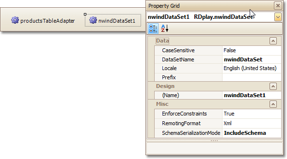

# Component Tray
The **Component Tray** shows components (non-visual report helpers) whose primary purpose is to [bind a report to data](../../create-reports/binding-a-report-to-data.md). You can click them to display and edit their settings using the [Property grid](property-grid.md).

> [!NOTE]
> Component management and data binding configuration are usually performed by system administrators or your application vendor, since these areas require advanced knowledge of database connectivity. You will rarely, if ever, need to access component settings when modifying existing reports.