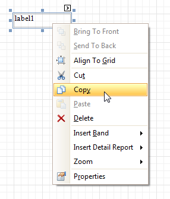

# Context Menu
The **Context Menu** can be invoked by the right-clicking a report...

... or its elements ([bands](../report-bands.md) and [controls](../report-controls.md)). This menu provides quick access to frequently used commands (e.g. zooming, clipboard operations, inserting bands, etc.) The available action set varies, depending on the element where you invoked the Context Menu.

