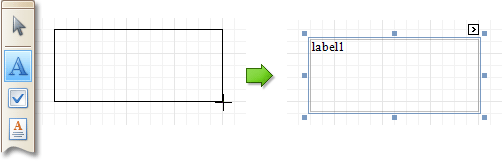

# Control Toolbox
The **Control Toolbox** lists all available [controls](../report-controls.md) and allows you to add them to your report.

To add a control from the Toolbox, do one of the following.
* Double-click an item in the Toolbox for the appropriate control, which will be created at the [Detail band](../report-bands/detail-band.md)'s top left corner.
* Drag and drop an item from the Toolbox onto the required location within a report.
	
	
* Select an item in the Toolbox, and then click the required location within a report.
* Select an item in the Toolbox, and then indicate the bounding rectangle by holding the left mouse button.
	
	

Select the  **Pointer** item when you need to perform selection, re-positioning or resizing operations. It is automatically selected after you drop a control onto a report.

If the Toolbox is hidden, you can enable it in the [Main Menu](main-menu.md), by selecting **View** | **Toolbars** | **Standard Controls**.