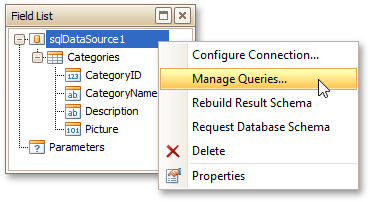
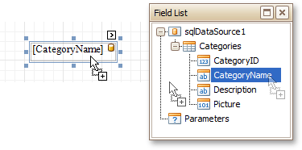

# Field List
The **Field List** is intended to display the structure of the data source to which a report is currently bound. This panel can also be used to create new bound report controls, manage [calculated fields](../../report-editing-basics/add-calculated-fields-to-a-report.md) and [report paramters](../../report-editing-basics/add-parameters-to-a-report.md).

This document consists of the following sections.
* [Manage a Data Source](#datasource)
* [Create Bound Report Elements](#binding)
* [Manage Calculated Fields](#calcfields)
* [Manage Report Parameters](#parameters)

## Manage a Data Source<a name="datasource"/>
After [binding a report to data](../../create-reports/binding-a-report-to-data.md), the Field List shows the structure of the report's data source (assigned to the **Data Source** property). You can right-click the data source to access and manage its settings.

## <a name="binding"/>Create Bound Report Elements
The Field List displays the list of all available data fields and allows you to create report elements that will show information from these fields.

For more information on creating data-bound report controls, see [Displaying Values from a Database (Binding Report Elements to Data)](../../report-editing-basics/displaying-values-from-a-database-(binding-report-elements-to-data).md).

If the report's **Show Designer's Hints** option is enabled, a tooltip appears when pointing to an item in the Field List. This tooltip describes the purpose of a data field and provides information about the field's type.

## <a name="calcfields"/>Manage Calculated Fields
The Field List allows you to create [calculated fields](../../report-editing-basics/add-calculated-fields-to-a-report.md) by building expressions based on the values of data fields, report parameter values, etc.

To add a calculated field to a report, right-click any item inside the data member node, and in the invoked context menu, select **Add Calculated Field**.

To edit settings of the created calculated field, select it and go to the [Property Grid](property-grid.md). You can also right-click the calculated field and use commands available in the context menu.

## <a name="parameters"/>Manage Report Parameters
The Field List shows existing report parameters and allows you to add new ones to the report. To create a parameter, right click the **Parameters** node or any of its sub-nodes, and in the context menu, select **Add Parameter**.

You can customize report parameters using the [Property Grid](property-grid.md) or commands available in the context menu in the same way as you can customize calculated fields.

If the Field List is hidden, you can enable it in the [Main Menu](main-menu.md) by selecting **View** | **Windows** | **Field List**.