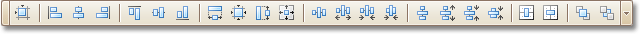

# Layout Toolbar
The **Layout Toolbar** allows you to easily align report elements to one another, change their size to match one another and customize spacing and z-order.

If the Layout Toolbar is hidden, you can enable it in the [Main Menu](main-menu.md), by selecting **View** | **Toolbars** | **Layout Toolbar**.