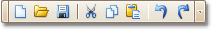

The **Main Toolbar** contains buttons which provide the capability to create new reports, save and load report layouts, cut, copy and paste report elements, and undo-redo actions in the Report Designer.

If the Main Toolbar is hidden, you can enable it in the [Main Menu](../../../../../../interface-elements-for-desktop/articles/report-designer/report-designer-for-winforms/report-designer-reference/report-designer-ui/main-menu.md), by selecting **View** | **Toolbars** | **Toolbar**.