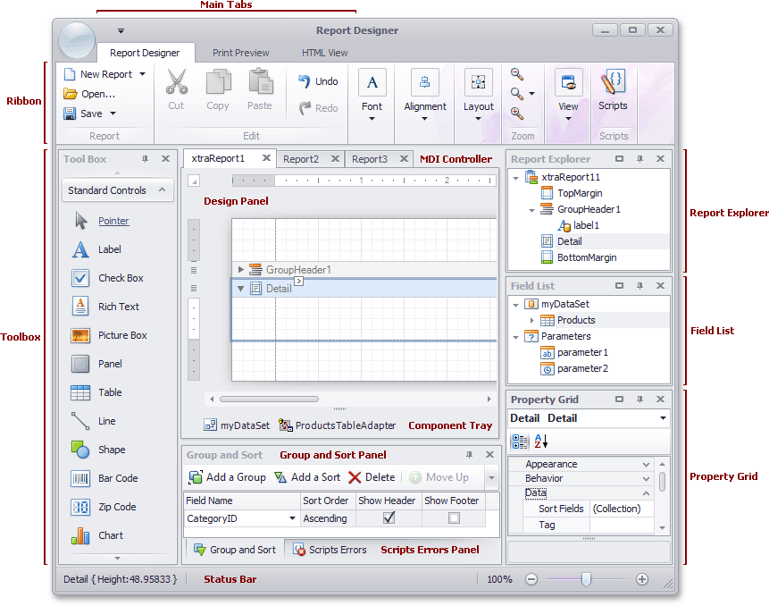

# Ribbon Designer Elements
This document describes elements that comprise the Ribbon Report Designer.

The following image illustrates a Ribbon Designer.

The following table lists all the main interface elements of the Ribbon Designer.

| Element | Description |
|---|---|
| **Ribbon** | The main toolbar in the Designer that contains the [Main](../../../../../../interface-elements-for-desktop/articles/report-designer/report-designer-for-winforms/report-designer-reference/report-designer-ui/main-toolbar.md), [Formatting](../../../../../../interface-elements-for-desktop/articles/report-designer/report-designer-for-winforms/report-designer-reference/report-designer-ui/formatting-toolbar.md), [Layout](../../../../../../interface-elements-for-desktop/articles/report-designer/report-designer-for-winforms/report-designer-reference/report-designer-ui/layout-toolbar.md) and [Zoom](../../../../../../interface-elements-for-desktop/articles/report-designer/report-designer-for-winforms/report-designer-reference/report-designer-ui/zoom-toolbar.md) toolbars, as well as the [Scripts Tab](../../../../../../interface-elements-for-desktop/articles/report-designer/report-designer-for-winforms/report-designer-reference/report-designer-ui/scripts-tab.md) button. |
| [Toolbox](../../../../../../interface-elements-for-desktop/articles/report-designer/report-designer-for-winforms/report-designer-reference/report-designer-ui/control-toolbox.md) | Contains controls that you can add to your report by dragging and dropping its icons onto a report's area. |
| **Main Tabs** | Allows you to switch between the [Designer](../../../../../../interface-elements-for-desktop/articles/report-designer/report-designer-for-winforms/report-designer-reference/report-designer-ui/designer-tab.md), [Preview](../../../../../../interface-elements-for-desktop/articles/report-designer/report-designer-for-winforms/report-designer-reference/report-designer-ui/preview-tab.md) and [HTML View](../../../../../../interface-elements-for-desktop/articles/report-designer/report-designer-for-winforms/report-designer-reference/report-designer-ui/html-view-tab.md) tabs. |
| **MDI Controller** | Provides the multi-document interface in the Designer by containing its [Design Panels](../../../../../../interface-elements-for-desktop/articles/report-designer/report-designer-for-winforms/report-designer-reference/report-designer-ui/design-panel.md). |
| [Design Panel](../../../../../../interface-elements-for-desktop/articles/report-designer/report-designer-for-winforms/report-designer-reference/report-designer-ui/design-panel.md) | A surface where a report is being edited. The Designer provides a multi-document interface, and can have as many [Design Panels](../../../../../../interface-elements-for-desktop/articles/report-designer/report-designer-for-winforms/report-designer-reference/report-designer-ui/design-panel.md) as there are reports open in it. |
| [Component Tray](../../../../../../interface-elements-for-desktop/articles/report-designer/report-designer-for-winforms/report-designer-reference/report-designer-ui/component-tray.md) | Shows components related to report data binding. You can click them to display and edit their settings using the [Property Grid](../../../../../../interface-elements-for-desktop/articles/report-designer/report-designer-for-winforms/report-designer-reference/report-designer-ui/property-grid.md). |
| [Report Explorer](../../../../../../interface-elements-for-desktop/articles/report-designer/report-designer-for-winforms/report-designer-reference/report-designer-ui/report-explorer.md) | Displays the structure of a report in a visual-tree form, which makes the report navigation easier. |
| [Field List](../../../../../../interface-elements-for-desktop/articles/report-designer/report-designer-for-winforms/report-designer-reference/report-designer-ui/field-list.md) | Shows the structure of a report's data source and is used to bind report controls to data. |
| [Property Grid](../../../../../../interface-elements-for-desktop/articles/report-designer/report-designer-for-winforms/report-designer-reference/report-designer-ui/property-grid.md) | Used to access and modify properties of a report and all its elements (bands and controls). |
| [Group and Sort Panel](../../../../../../interface-elements-for-desktop/articles/report-designer/report-designer-for-winforms/report-designer-reference/report-designer-ui/group-and-sort-panel.md) | Allows you to quickly perform grouping and sorting operations throughout a report, and visually represents the report's grouping structure. |
| [Scripts Errors Panel](../../../../../../interface-elements-for-desktop/articles/report-designer/report-designer-for-winforms/report-designer-reference/report-designer-ui/scripts-errors-panel.md) | When errors are found in a report's scripts (after clicking **Validate** in the [Scripts Tab](../../../../../../interface-elements-for-desktop/articles/report-designer/report-designer-for-winforms/report-designer-reference/report-designer-ui/scripts-tab.md)), it lists these errors. Clicking an error opens the corresponding script section in the Scripts tab. |
| [Status Bar](../../../../../../interface-elements-for-desktop/articles/report-designer/report-designer-for-winforms/report-designer-reference/report-designer-ui/status-bar.md) | Provides tips and specific information about the Designer element being hovered by a cursor or an action being currently performed. |