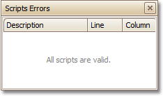

The **Scripts Errors Panel** displays the result of scripts validation after it's forced in the [Scripts Tab](../../../../../../interface-elements-for-desktop/articles/report-designer/report-designer-for-winforms/report-designer-reference/report-designer-ui/scripts-tab.md).

Then, if errors are located, they are listed in this panel. To get to the corresponding line of code, click the corresponding item in the panel's list.

Or, if all scripts are valid, the panel reports this.

For more information, refer to [Handle Events via Scripts](../../../../../../interface-elements-for-desktop/articles/report-designer/report-designer-for-winforms/create-reports/miscellaneous/handle-events-via-scripts.md).