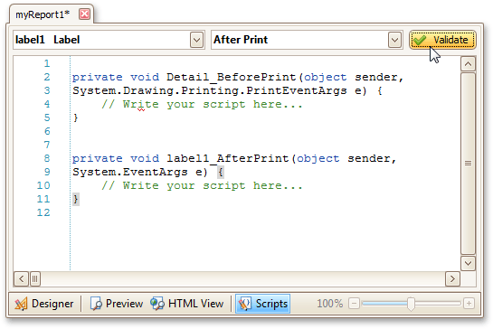

# Scripts Tab
The **Scripts Tab** allows you to manage your report's scripts. It provides centralized access to all the scripts being written for a report or any of its elements ([bands](../../../../../../interface-elements-for-desktop/articles/report-designer/report-designer-for-winforms/report-designer-reference/report-bands.md) and [controls](../../../../../../interface-elements-for-desktop/articles/report-designer/report-designer-for-winforms/report-designer-reference/report-controls.md)).

The built-in scripts validation capability is provided in this tab. After clicking **Validate**, the result is displayed in the [Scripts Errors Panel](../../../../../../interface-elements-for-desktop/articles/report-designer/report-designer-for-winforms/report-designer-reference/report-designer-ui/scripts-errors-panel.md).

For more information, refer to [Handle Events via Scripts](../../../../../../interface-elements-for-desktop/articles/report-designer/report-designer-for-winforms/create-reports/miscellaneous/handle-events-via-scripts.md).