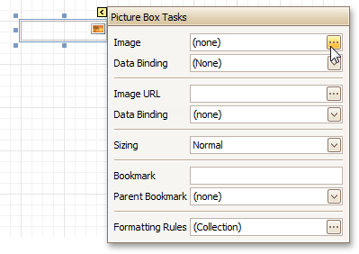

# Smart Tag
Most report elements have **Smart Tags** that provide easy access to the most frequently used settings. Clicking an element's Smart Tag invokes an actions list with action links and editors, allowing you to customize this element.
* **Report Smart Tag**
	
	A report's Smart Tag icon is located at the top left corner of the [Design Panel](design-panel.md).
	
	
* **Band Smart Tag**
	
	A band's Smart Tag icon is located on the band strip right next to its caption. For instance, the Smart Tag for the [Page Header](../report-bands/page-header-and-footer.md) is shown in the following image.
	
	
* **Control Smart Tag**
	
	A control's Smart Tag icon is located at the top right corner of the control. For instance, the Smart Tag for the [Rich Text](../report-controls/rich-text.md) control is shown in the following image.
	
	
	
	And, this is the Smart Tag for the [Picture Box](../report-controls/picture-box.md) control.
	
	