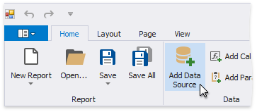
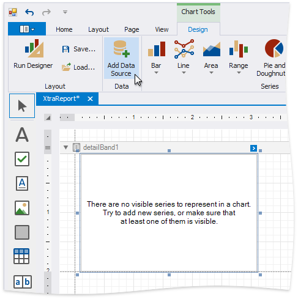
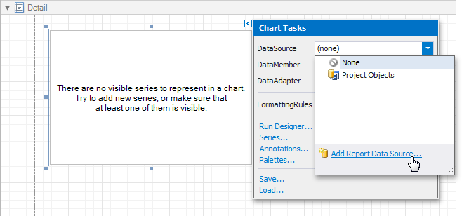

# Data Source Wizard

The Data Source Wizard enables you to configure a data source and retrieve the required data. It supports the following data source types:

* [Database](report-wizard\data-bound-report\connect-to-a-database.md)
	
	Obtains data from all major data providers (Microsoft SQL Server, XML data, Microsoft Access, Oracle, etc.).
* [Entity Framework](report-wizard\data-bound-report\connect-to-an-entity-framework-data-source.md)
	
	Supports binding to a Microsoft ADO.NET Entity Framework data source.
* [Object Binding](report-wizard\data-bound-report\connect-to-an-object-data-source.md)
	
	Connects to a data object.
* [Excel File](report-wizard\data-bound-report\connect-to-an-excel-data-source.md)
	
	Obtains data from Microsoft Excel workbooks (XLS, XLSX or XLSM files) or CSV files.

The Data Source Wizard allows you to do the following:

* Bind an existing report or its [Detail Report band](../introduction-to-banded-reports.md) to data. To invoke this Wizard, click **Add Data Source** on the [Ribbon](toolbar.md)'s **Home** page.

    
	
    Alternatively, click the report's smart tag, expand the **DataSource** property's drop-down menu and click **Add Report Data Source**.

	
	
* Connect the [Chart](../use-report-elements/use-charts-and-pivot-grids.md), [Pivot Grid](../create-popular-reports/create-a-cross-tab-report.md) and [Sparkline](../use-report-elements/use-gauges-and-sparklines.md) report controls to individual data sources.

    You can invoke the Data Source Wizard using the **Add Data Source** command on the **Chart** | **Design** contextual page.

    

    You can invoke the Data Source Wizard using the **DataSource** property in the chart's smart tag.
	
	