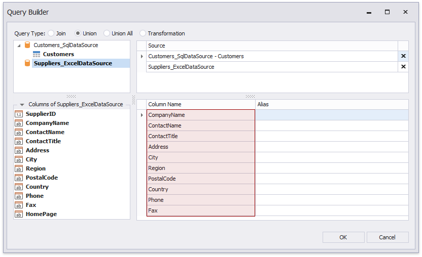

# Create a Federated Query

On this wizard page, you can create federated queries based on data from other data sources.

Note that initial data sources can contain data at the root level (e.g., an [Excel data source](../../../bind-to-data/bind-a-report-to-an-excel-workbook.md)) or have one or more queries (e.g., a [SQL data source](../../../bind-to-data/bind-a-report-to-a-database.md)).

## Include Data into Separate Queries

Enable check boxes for data fields, queries and/or entire data sources.

The selected items are included in data federation as separate queries based on initial data source queries.

The wizard specifies query names as follows:

* If the initial data source contains one or more queries (such as in a SQL data source), the federated query name consists of the data source name and query name separated by an underscore.
* If the initial data source contains data at the root level (such as in an Excel data source), federated query name is equivalent to the data source name.

## Combine Data into a Single Query

To combine data from multiple data sources into a single query, click **Add Query**.

This invokes the [Query Builder](../../query-builder.md) adapted to federated data sources. Specify the query type.

- **Join**

    Drag and drop items onto the design surface, and specify join relationships in the **Join Editor**.

    

    Enable check boxes for the data fields you want to include in the query result set.

    

- **Union and Union All**

    Double-click the data sources you want to combine into a single query. The query includes only fields that have identical names and types in the origin sources.

    

    Rename fields.

    

    > [!Tip]
    > When you use the **Union** mode, duplicate data from the origin data sources is removed from the query result set. Use the **Union All** mode to include all data.

The created query appears on the wizard page in the **Federated Queries** category. The federated query's default name is equivalent to the main table name. 

You can click the  button to customize the query or the  button to remove the query. 

Once you finish the wizard, it creates a federated data source that includes a single query.

## Specify Master-Detail Relationships

Click **Manage Relations** to define master-detail relationships between two or more queries.

In the invoked editor, drag and drop the key field from the master query to the detail query.

Once the wizard is complete, you can see the master-detail hierarchy in the Field List.

