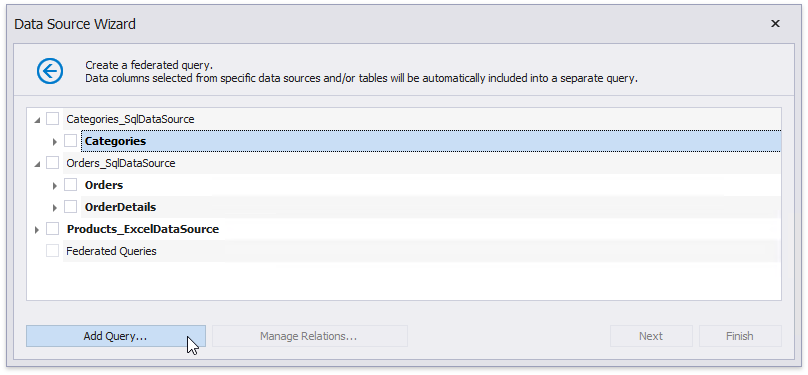

# Create a Federated Query

On this wizard page, you can create federated queries based on data from other data sources.

Note that initial data sources can contain data at the root level (e.g., an [Excel data source](../../../bind-to-data/bind-a-report-to-an-excel-workbook.md)) or have one or more queries (e.g., a [SQL data source](../../../bind-to-data/bind-a-report-to-a-database.md)).

## Include Data into Separate Queries

Enable check boxes for data fields, queries and/or entire data sources.

The selected items are included in data federation as separate queries based on initial data source queries.

The wizard specifies query names as follows:

* If the initial data source contains one or more queries (such as in a SQL data source), the federated query name consists of the data source name and query name separated by an underscore.
* If the initial data source contains data at the root level (such as in an Excel data source), federated query name is equivalent to the data source name.

Right-click the federated data source and choose **Manage Relations**. This invokes the **Master-Detail Relation Editor** you can use to [specify a master-detail relationship](#specify-master-detail-relationships) between the separate queries.

## Combine Data into a Single Query

To combine data from multiple data sources into a single query, click **Add Query**.

This invokes the [Query Builder](../../query-builder.md) designed to federated data sources.

You can use the **Join**, **Union**, **Union All**, and **Transform** query types to combine data. Refer to the following articles for more information on these query types.

* [Bind a Report to a Join-Based Federated Data Source](../../../bind-to-data/bind-a-report-to-a-join-based-federated-data-source.md)
* [Bind a Report to a Union-Based Federated Data Source](../../../bind-to-data/bind-a-report-to-a-union-based-federated-data-source.md)
* Bind a Report to a Transformation-Based Data Source

## Specify Master-Detail Relationships

Click **Manage Relations** to define master-detail relationships between two or more queries.

In the invoked editor, drag and drop the key field from the master query to the detail query.

Once the wizard is complete, you can see the master-detail hierarchy in the Field List.

For more information, refer to the following guide: [Bind a Report to a Federated Master-Detail Data Source](../../../bind-to-data/bind-a-report-to-a-federated-master-detail-data-source.md).