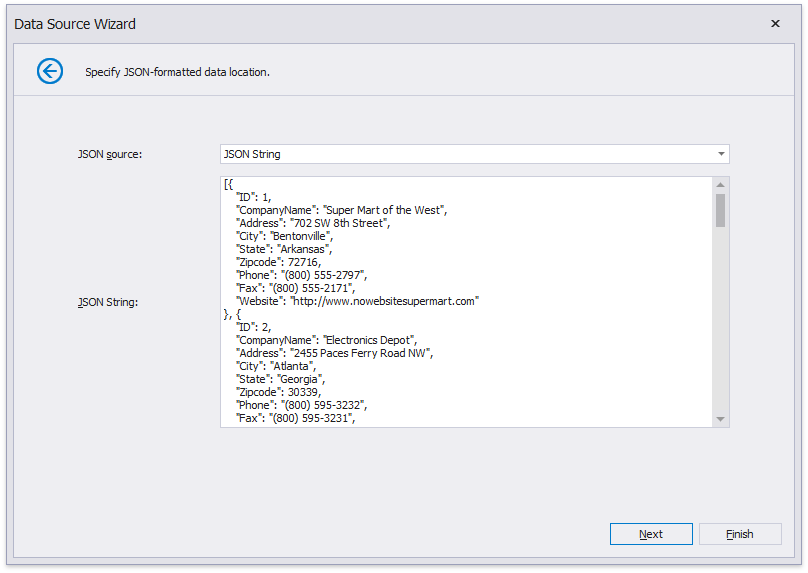

# Specify JSON Data Location

This wizard page allows you to specify the location of the JSON-formatted data:

- Web Service Endpoint URI

    

- File Name

    

- String with JSON Content

     
