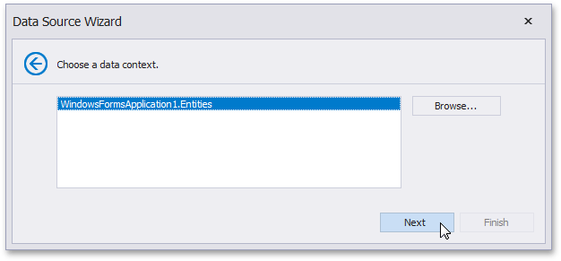

# Select the Data Context

On this page, select the required data context from the list of available data contexts.

If the **Browse** button is available on this page, you can also select a data context from a custom assembly.

Click **Next** to proceed to the next wizard page: [Select a Connection String](select-a-connection-string.md).