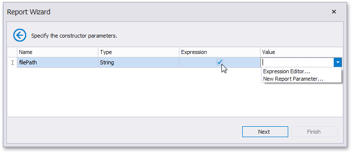

# Specify the Constructor Parameters

On this wizard page, specify the constructor parameters.

To specify the constructor parameter's value, use the **Value** column. Enable the check box in the **Expression** column to make it possible to specify the parameter expression using the **Expression Editor**. In this case, you can pass an existing [report parameter](../../../shape-report-data/use-report-parameters.md) to the constructor or even create a new report parameter using the in-place editor.

