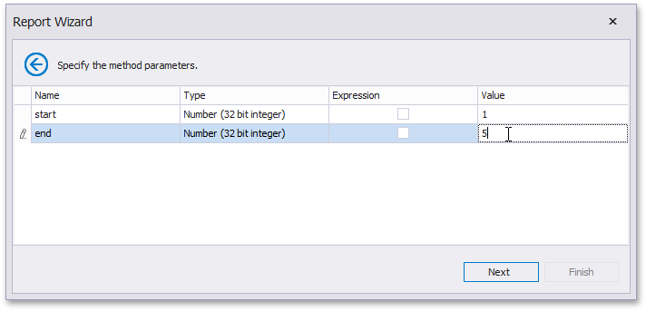

# Specify the Member Parameters

On this wizard page, specify the member parameters.

To specify the member parameter's value, use the **Value** column. Enable the check box in the **Expression** column to make it possible to specify the parameter expression using the **Expression Editor**. In this case, you can pass an existing report parameter to the member or even create a new report parameter using the in-place editor.

Click **Next** to proceed to the next wizard page: [Select the Data Binding Mode](select-the-data-binding-mode.md).