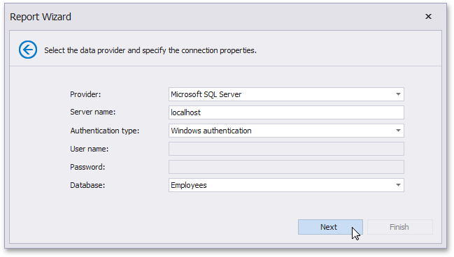
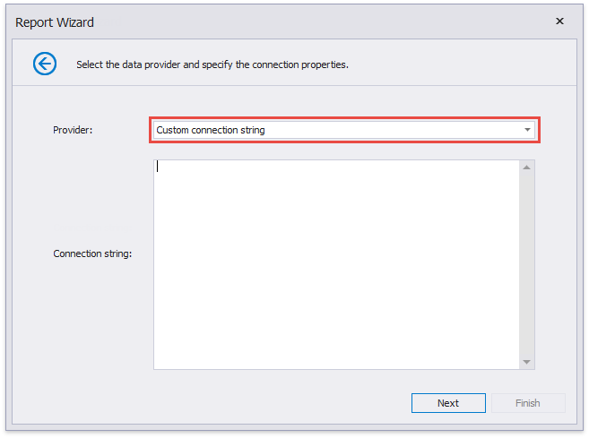

# Specify a Connection String

This page allows you to specify connection string parameters or define a custom connection string.

The following data source types are supported.

* Amazon Redshift
* Firebird
* Google BigQuery
* IBM DB2
* Microsoft Access 2007
* Microsoft Access 97
* Microsoft SQL Server
* Microsoft SQL Server Compact Edition
* MySQL
* Oracle
* Pervasive PSQL
* PostgreSQL
* SAP Sybase Advantage
* SAP Sybase ASE
* SAP Sybase SQL Anywhere
* SQLite
* Teradata
* VistaDB
* VistaDB5
* XML file

Depending on the data provider selected, it may be necessary to specify additional connection options (such as authentication type and database name) on this page.

Click **Next** to proceed to the next wizard page.

## Define a Custom Connection String

Select **Custom connection string** and specify the connection string.

Use the <b>XpoProvider</b> parameter to identify a data source provider. For example, *XpoProvider=**MSSqlServer**;Data Source=(local);User ID=username;Password=password;Initial Catalog=database;Persist Security Info=true*

Click **Next** to proceed to the next wizard page: [Save the Connection String](save-the-connection-string.md).