# Query Builder

The **Query Builder** provides a visual interface for constructing SQL queries used to access database tables and views.

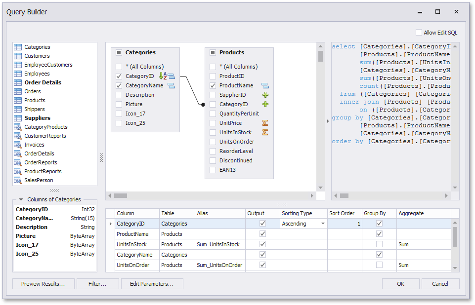

> [!NOTE]
> The Query Builder is not available for [object](report-wizard\data-bound-report\connect-to-an-object-data-source.md), [Entity Framework](report-wizard\data-bound-report\connect-to-an-entity-framework-data-source.md) and [Excel](report-wizard\data-bound-report\connect-to-an-excel-data-source.md) data sources.

## Run the Query Builder
You can invoke the **Query Builder** from the [query customization](report-wizard\data-bound-report\connect-to-a-database\create-a-query-or-select-a-stored-procedure.md) page of the [Report Wizard](report-wizard.md). On this page, click the  button for the **Queries** category to create a new query using the Query Builder.

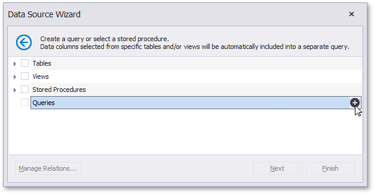

You can use the Query Builder to add queries to an existing SQL data source, as well as to edit existing queries. To do this, right-click the data source in the [Report Explorer](ui-panels\report-explorer.md) or [Field List](ui-panels\field-list.md), and select **Manage Queries...** in the context menu.

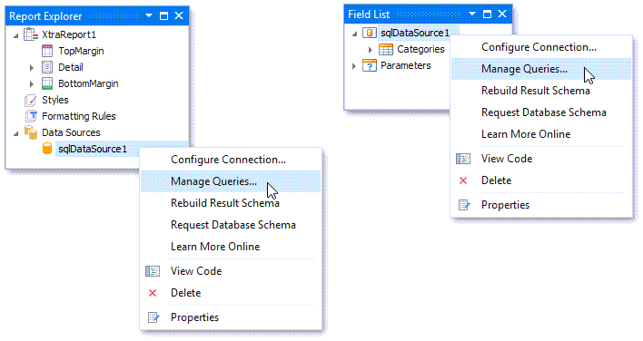

In the invoked **Manage Queries** dialog, click **Add** to add a new query. To edit an existing query, click the ellipsis button for it.

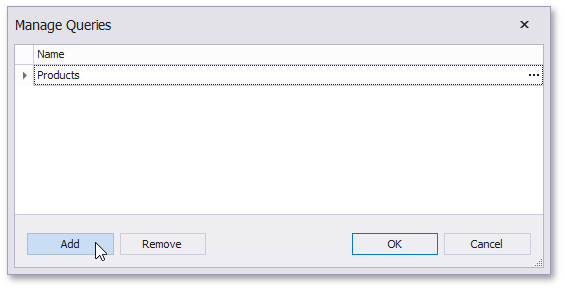

Finally, click the **Run Query Builder...** button in the invoked **Query Editor**.

## Select Tables
You can add a specific data table or view to a query by dragging the corresponding item from the list of available tables and dropping it onto the list of data tables to be used.

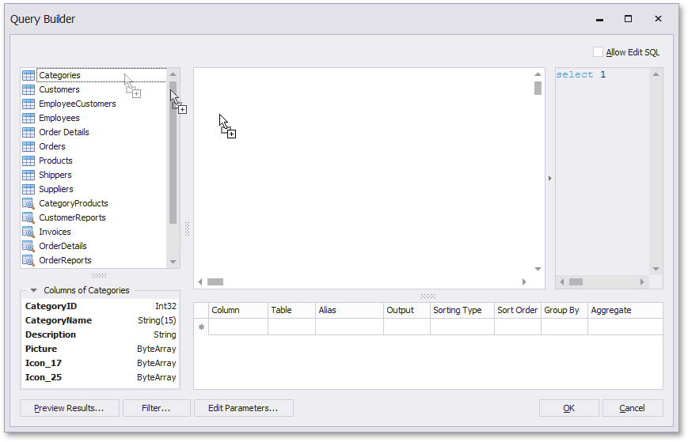

Enable check boxes for the table fields that you want to include in the query result set.

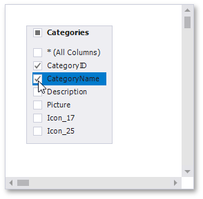

Each table provides the context menu, which allows you to rename the table or remove it from the query.

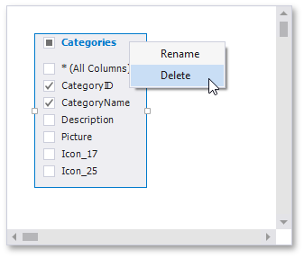

Click the list of available tables on the left and press CTRL+F to search for a specific table or view.

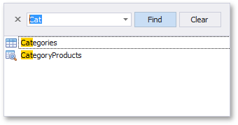

## Join Tables
You can join multiple tables within the same query. The Query Builder automatically highlights tables related to any of the previously added tables. Drag-and-drop a subordinate table in the same way you added a main table to include it in a query and automatically create an inner join relation based on a key column.

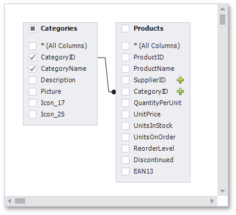

Alternatively, you can join tables by clicking the plus button  in a row corresponding to a key column.

You can customize the relationship by right-clicking it on the diagram and selecting **Edit Relation** in the invoked context menu. Use the **Join Editor** to select the join type (**Left Outer** or **Inner**), apply a logical operator (**Equals to**, **Is less than**, etc.) and column key fields.

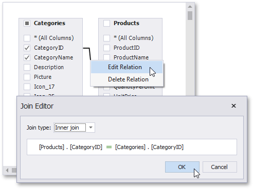

A left outer join returns an inner join’s values, along with all the values in the "left" table that do not match the "right" table, including rows with NULL (empty) values in the key field.

When the left outer join is selected, the relationship line displays an arrow pointing to the "right" table.

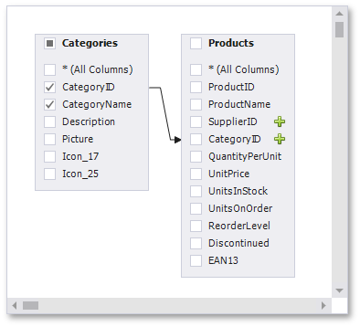

You can manually join tables if they do not have a relationship at the database level. In this case, when you drag-and-drop a table onto the list of tables, the **Join Editor** is automatically invoked allowing you to construct a custom **join** relationship.

After executing the query, it returns a "flat" table composed of data records selected based on the specified join options.

> [!NOTE]
> Although joining different tables within a single query may be required in some scenarios, creating [hierarchical data sources](report-wizard\data-bound-report\connect-to-a-database\create-a-query-or-select-a-stored-procedure.md) generally results in better performance (in general, [master-detail reports](..\create-popular-reports\create-a-master-detail-report-use-detail-report-bands.md) are generated faster than similar-looking reports created by grouping "flat" data sources).

## Edit Parameters
Click the **Edit Parameters** button to invoke the **Query Parameters** dialog, which allows you to add and remove [query parameters](..\shape-report-data\use-report-parameters\use-query-parameters.md) as well as specify parameter settings.

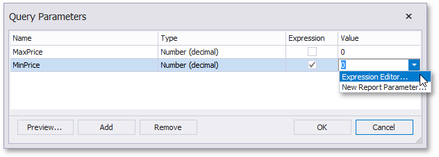

For each query parameter, the following properties are available.

* **Name** - specifies the name used to refer a parameter.
* **Type** - specifies the data type of the parameter's value.
* **Expression** - determines whether the actual parameter value is static or generated dynamically.
* **Value** - specifies the actual value of a query parameter. If the **Expression** option is enabled, the actual parameter value is produced dynamically by calculating an associated [expression](../use-expressions.md), which is particularly useful when you need to map the query parameter value to the value of a [report parameter](..\shape-report-data\use-report-parameters.md).

The created parameters will be then available on the [Configure Query Parameters](report-wizard/data-bound-report/connect-to-a-database/configure-query-parameters.md) wizard page.

For general information on query parameters and ways of providing parameter values, see [Query Parameters](..\shape-report-data\use-report-parameters\use-query-parameters.md).

## Filter Data
To specify filter criteria, click the **Filter...** button in the Query Builder. This invokes the **Filter Editor**, which provides the following capabilities.

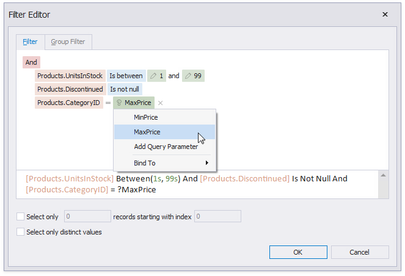

* **Filter Tab**
	
	The editor contains the **Filter** tab allowing you to specify filter conditions for resulting data. Filter criteria can be assigned [query parameters](report-wizard/data-bound-report/connect-to-a-database/configure-query-parameters.md) or bound to [report parameters](..\shape-report-data\use-report-parameters.md).
* **Group Filter Tab**
	
	The **Group Filter** tab allows you to specify filter conditions for grouped and aggregated data. If data is not grouped, the second tab is disabled.
* **Other Options**
	
	Using this editor, you can limit the number of resulting data rows. If data is sorted, you can specify how many rows to skip before retrieving the specified number of rows.
	
	> [!NOTE]
	> Depending on the selected data provider, it can be impossible to take into account the skip setting in the provider-specific SQL string.
	
	Another option enables you to include only distinct values into the resulting set.

## Shape Data
The Query Builder displays the column list under the data source editor, which provides various shaping options:

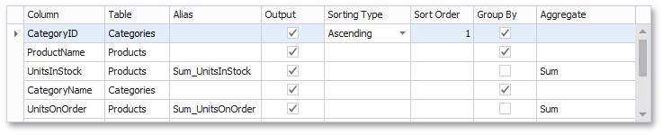

* **Column**
	
	Specifies the selected column.
	
	You can choose a column from the drop-down list or create a column expression by clicking the corresponding column's ellipsis button.
	
	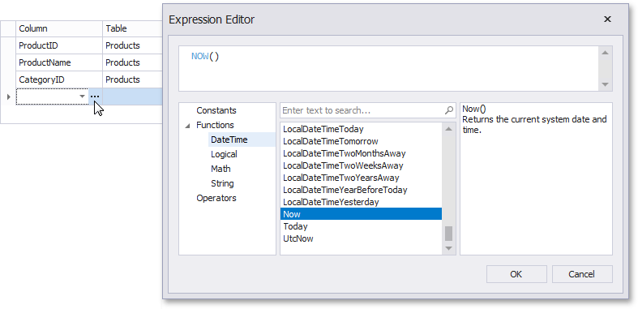
* **Table**
	
	Specifies the table containing the selected column.
	
	This option indicates **(All Tables)** if you created an expression for the corresponding column.
* **Alias**
	
	Specifies a custom column name (alias).
	
	This option is available only for columns that you included in a query.
* **Output**
	
	Specifies whether to include the column in the query's resulting set.
* **Sorting Type**
	
	Specifies whether to preserve the original data record order within the column or sort them (ascending or descending).
	
	> [!NOTE]
	> When binding to XML files, the Query Builder does not support sorting by aggregate functions, DISTINCT and SELECT ALL statements, and custom SQL.
* **Sort Order**
	
	This option becomes available after applying sorting to the data column records.
	
	It defines the priority in which sorting is applied to multiple columns (a lower number has a higher priority).
	
	For example, if column **A** has the sort order set to **1** and column **B** has it set to **2**, the query is first sorted by column **A** and then by the column **B**.
	
	Changing this setting for one column automatically updates other columns’ sorting order to avoid conflicting priorities.
* **Group By**
	
	Specifies whether to group the query's resulting set by this column.
* **Aggregate**
	
	Specifies whether to aggregate the column's data records.
	
	The following aggregate functions are supported:
	
	* Count
	* Max
	* Min
	* Avg
	* Sum
	* CountDistinct
	* AvgDistinct
	* SumDistinct
	
	Applying any of these functions to a column discards individual data records from the query result set, which only includes the aggregate function result.

> [!NOTE]
> You should apply aggregation/grouping to either all columns or none of them.

## Preview Results
You can preview the query execution's result in a tabular form by clicking the **Preview Results** button.

This opens the **Data Preview** window displaying the query result set (limited to the first 1000 data records).

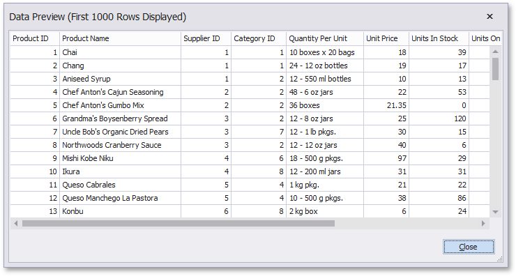