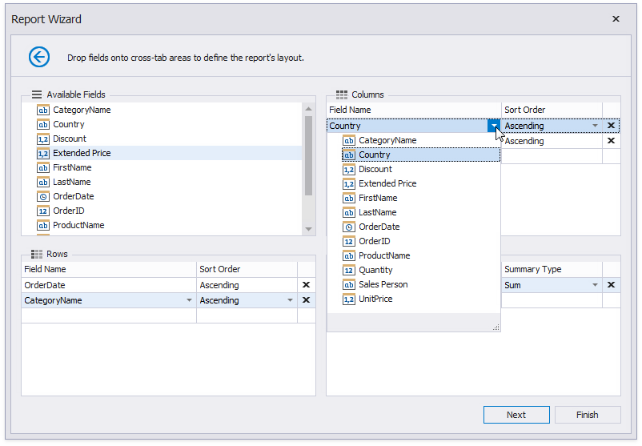
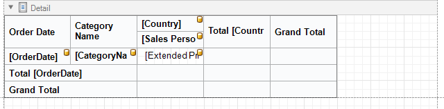

# Cross-Tab Report

Select **Cross-Tab Report** on the wizard's [start page](../report-wizard.md) to create a [cross-tab report](../../create-reports/cross-tab-reports.md) that displays multi-dimensional data.

Click **Next** and use the [Data Source Wizard](../data-source-wizard.md) to set up a report's data source.

Once the data source is configured, you can define the report's layout on the next page. Drop data fields onto the following cross-tab area:

* **Rows** - defines row headers;
* **Columns** - defines column headers;
* **Data** - defines fields against which to calculate summaries.

You can also select a field from the corresponding drop-down list.

> [!Note]
> The field order defines the hierarchy in the resulting cross-tab report. The higher the field on the list, the higher the level in the field hierarchy.

You can click **Finish** to stop the Report Wizard. If you want to customize the report further, click **Next** and proceed to the next pages:

* [Specify Report Page Settings](table-report/specify-report-page-settings.md)
* [Choose a Report Color Scheme](table-report/choose-a-report-color-scheme.md)
* [Set the Report Title](table-report/set-the-report-title.md)

The generated report contains the [Cross Tab](../../use-report-elements/use-cross-tabs.md) control that is configured based on the specified settings. The XRCrossTab control calculates automatic totals and grand totals across row and column fields.

