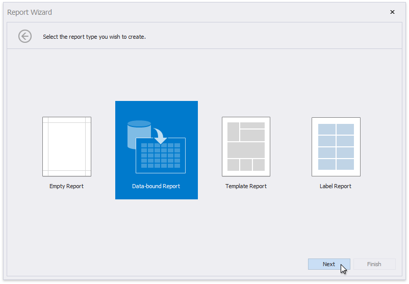

# Data-Bound Report

To create a new report and connect it to data, [run the Report Wizard](xref:4254) and select **Data-bound Report**.

The Report Wizard can include the following pages (depending on the selected data source type):

* [Select the Data Source Type](report-wizard\data-bound-report\select-the-data-source-type.md)
* [Choose Fields to Display in a Report](report-designer\report-designer-for-winforms\report-designer-tools\report-wizard\data-bound-report\choose-fields-to-display-in-a-report.md)
* [Add Grouping Levels](report-designer\report-designer-for-winforms\report-designer-tools\report-wizard\data-bound-report\add-grouping-levels.md)
* [Specify Summary Options](report-designer\report-designer-for-winforms\report-designer-tools\report-wizard\data-bound-report\specify-summary-options.md)
* [Set the Report Title](report-wizard\data-bound-report\set-the-report-title.md)