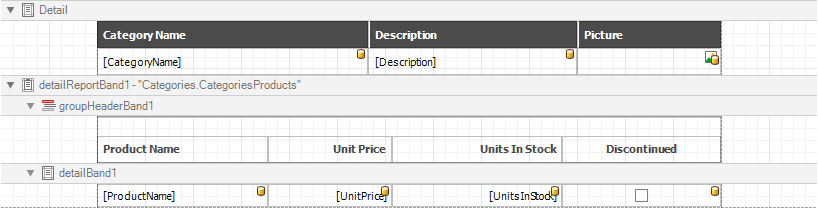

# Choose Fields to Display in a Report

This wizard page allows you to select data members for a report and its detail reports as well as choose data fields to display in these reports.

The list on the left-hand side displays queries and [master-detail relationships](../../../create-popular-reports\create-a-master-detail-report-use-detail-report-bands.md) specified on the previous wizard page. Select required check boxes to create relevant reports and assign their **DataMember** property.

In the list on the right-hand side, choose data fields from the selected data members to include into corresponding reports.

After completing the wizard, the report is constructed according to the following:

* If you select one query, it assigns to the report's **DataMember** property. The selected fields with corresponding captions are automatically added to the report's [Detail Band](../../../introduction-to-banded-reports.md).
* If you select two or more queries, this creates the [Detail Report Band](../../../introduction-to-banded-reports.md) for each query at the same hierarchical level. The **DataMember** properties of these detail reports are assigned to the corresponding queries.
* For each selected master-detail relationship, the [Detail Report Band](../../../introduction-to-banded-reports.md) with the **DataMember** property set to this relationship is created under the corresponding master report.

You can stop the wizard at this step by clicking **Finish**. The created report looks similar to the image below.

If you want to customize the report further, click **Next** to go to the [Add Grouping Levels](add-grouping-levels.md) page.