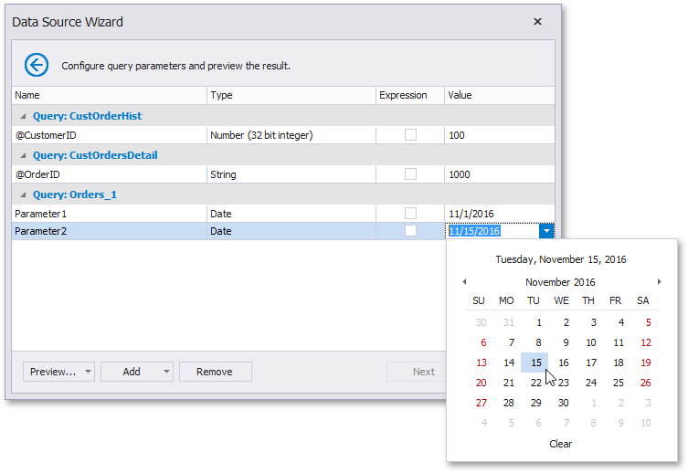
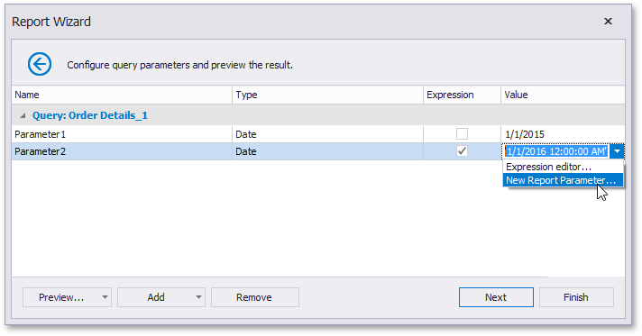
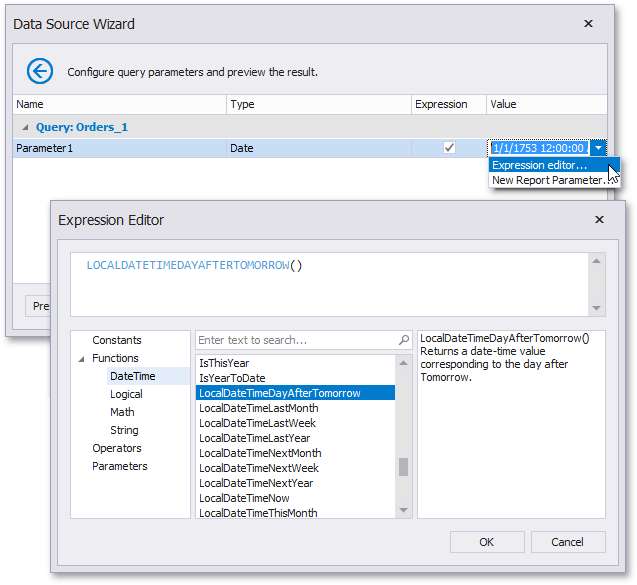
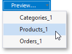
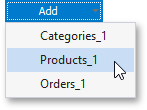

# Configure Query Parameters
> [!NOTE]
> This wizard step appears only if you're creating a new report from scratch. In this instance, familiarity with database connections is required, so we recommend that you contact your application administrator or vendor for assistance. If you're modifying an existing report, this step will not appear and you will start with the [Choose Fields to Display in a Report](../choose-fields-to-display-in-a-report.md) wizard page.

On this wizard page, you can manage parameters that are used in queries and/or stored procedures selected on the [previous wizard page](create-a-query-or-select-a-stored-procedure.md), as well as specify parameter values.

## Specify Parameter Values

A parameter value can be specified in one of the following ways.
* Parameters can be assigned static values (according to the specified parameter type), which is illustrated in the following image.
	
	
* Alternatively, you can link a query or stored procedure parameter to a [report parameter](../../../../shape-report-data/use-report-parameters.md), whose value can be requested each time before the report document is to be previewed or exported. To do this, enable the **Expression** check box and select an existing report parameter of the corresponding type or create a new one.
	
	
* Another option is to calculate a parameter value based on an expression. To do this, enable the **Expression** check box and run the **Expression Editor**.
	
	

## Manage Parameters
To delete a specific parameter, select it on this wizard page and click **Remove**.

To execute a specific query with the specified parameter values, click **Preview** and select a query.

When previewing a query or stored procedure result, only **1000** first data rows are displayed. If a query contains a custom SQL, the entire result set is obtained.

To create a new query parameter, click **Add** and select a query.

You can stop the wizard at this step by clicking **Finish**.

To continue report customization, click **Next** to proceed to the next wizard page: [Choose Fields to Display in a Report](../choose-fields-to-display-in-a-report.md).