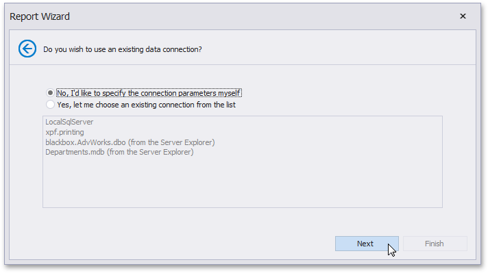

# Select a Data Connection
> [!NOTE]
> This wizard step appears only if you're creating a new report from scratch. In this instance, familiarity with database connections is required, so we recommend that you contact your application administrator or vendor for assistance. If you're modifying an existing report, you will skip this step and start with the [Choose Fields to Display in Your Report](../choose-fields-to-display-in-a-report.md) wizard page.

On this page, you can either select one of the currently available data connections from the list or create a new one.

Click **Next** to proceed to the next wizard page, depending on the selected option.

* [Specify a Connection String](specify-a-connection-string.md)
* [Create a Query or Select a Stored Procedure](create-a-query-or-select-a-stored-procedure.md)