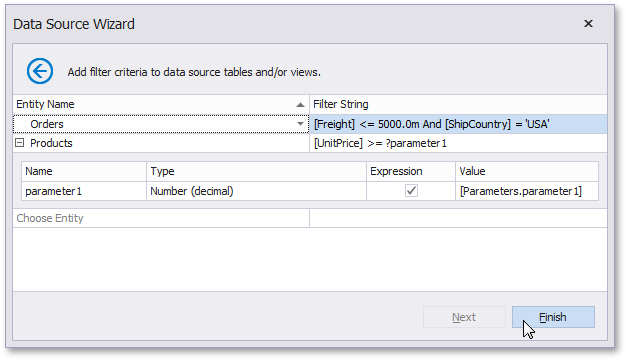

# Configure Filters

> [!NOTE]
> This wizard step appears only if you're creating a new report from scratch. If you're modifying an existing report, this step will not appear and you will start with the [Choose Fields to Display in a Report](../choose-fields-to-display-in-a-report.md) wizard page.

This wizard page allows you to define any number of [filter criteria](../../../../use-expressions.md) for your data source.

The **Filter Editor** is displayed after choosing an entity on this wizard page.

Use this editor to define the selected entity's filter criteria. The filter string can also reference [report parameters](../../../../shape-report-data/use-report-parameters.md).

Click **Finish** to close the wizard or **Next** to proceed to the next Report Wizard page: [Choose Fields to Display in a Report](../choose-fields-to-display-in-a-report.md).
