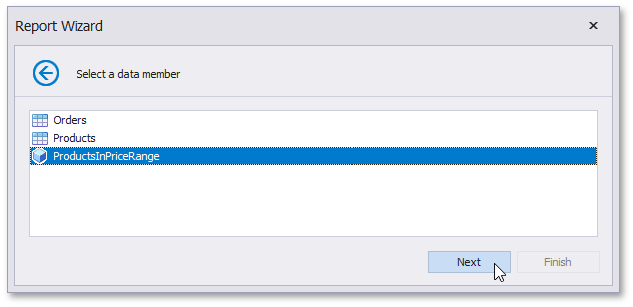

# Select a Data Member
> [!NOTE]
> This wizard step appears only if you're creating a new report from scratch. If you're modifying an existing report, this step will not appear and you will start with the [Choose Fields to Display in s Report](../choose-fields-to-display-in-a-report.md) wizard page.

On this page, select the required data member from the list of available data members.

Click **Next** to proceed to the next wizard page: [Configure Filters](configure-filters.md).