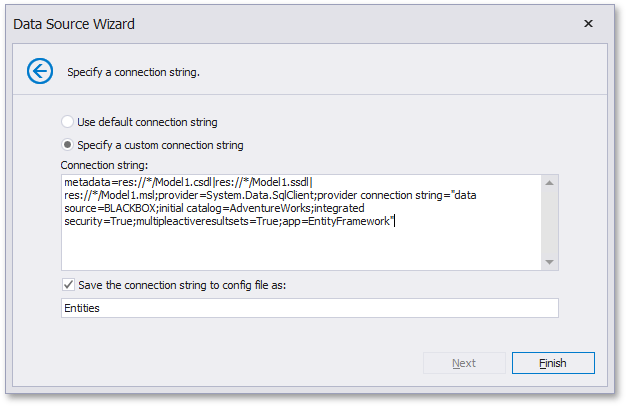

# Specify a Connection String
> [!NOTE]
> This wizard step appears only if you're creating a new report from scratch. If you're modifying an existing report, this step will not appear and you will start with the [Choose Fields to Display in a Report](../choose-fields-to-display-in-a-report.md) wizard page.

On this page, you can either use the default connection string or manually specify a connection sting. Additionally, this page requires you to specify whether or not to save the connection string in the configuration file.

Click **Next** to proceed to the next wizard page. If the current Entity Framework model provides stored procedures, go to the [Bind to a Stored Procedure](bind-to-a-stored-procedure.md) page; otherwise, proceed to the [Select a Data Member](select-a-data-member.md) page.