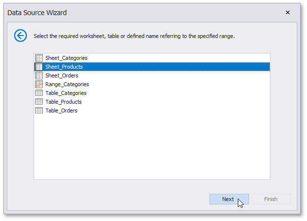

# Select a Worksheet, Table or Named Region
> [!NOTE]
> This wizard step appears only if you're creating a new report from scratch and if you have selected a Microsoft Excel Workbook on the previous step. If you're modifying an existing report, this step will not appear and you will start with [Choose Fields to Display in a Report](../choose-fields-to-display-in-a-report.md) wizard page.

On this wizard page, select one of the available worksheets, tables or named regions.

Click **Next** to proceed to the next wizard page: [Choose Columns](choose-columns.md).