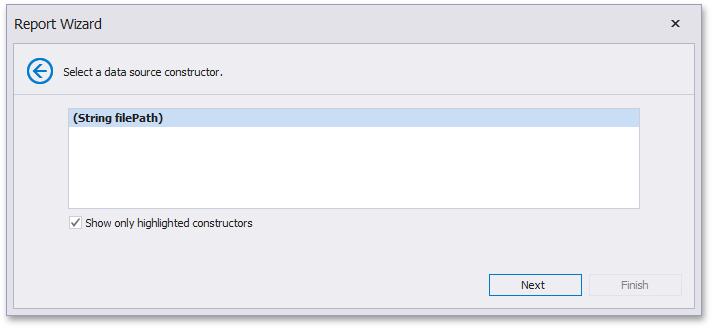

# Select a Data Source Constructor
> [!NOTE]
> This wizard step appears only if you're creating a new report from scratch. If you're modifying an existing report, this step will not appear and you will start with the [Choose Fields to Display in a Report](../choose-fields-to-display-in-a-report.md) wizard page.

On this page, select one of the available data source constructors. To exclude irrelevant constructors from the list, select the **Show only highlighted constructors** check box.

Click **Next** to proceed to the next wizard page: [Specify the Constructor Parameters](specify-the-constructor-parameters.md).