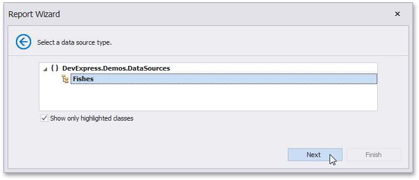

# Select a Data Source Type
> [!NOTE]
> This wizard step appears only if you're creating a new report from scratch. If you're modifying an existing report, this step will not appear and you will start with the [Choose Fields to Display in a Report](../choose-fields-to-display-in-a-report.md) wizard page.

On this wizard page, select a required data source type. To exclude irrelevant classes from the list, select the **Show only highlighted classes** check box.

Click **Next** to proceed to the next wizard page: [Select a Data Source Member](select-a-data-source-member.md).