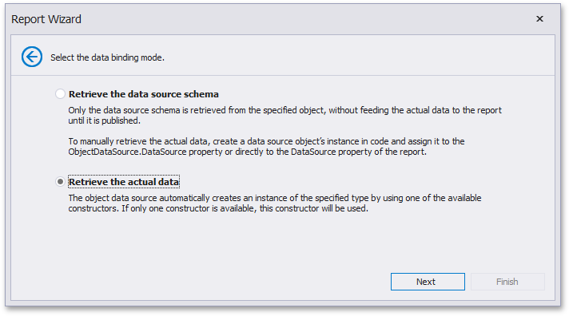

# Select the Data Binding Mode
> [!NOTE]
> This wizard step appears only if you're creating a new report from scratch. If you're modifying an existing report, this step will not appear and you will start with the [Choose Fields to Display in a Report](../choose-fields-to-display-in-a-report.md) wizard page.

On this wizard page, you can choose one of the following two binding modes.
* **Retrieve the data source schema** - Select this option to retrieve only the data source schema from the specified object and edit the report layout without having access to the actual underlying data.
* **Retrieve the actual data** - Select this option to automatically create an instance of the data source type and obtain its actual data.

Click **Next** to proceed to the next wizard page depending on the selected option.
* [Choose Fileds to Display in a Report](../choose-fields-to-display-in-a-report.md)
* [Select a Data Source Constructor](select-a-data-source-constructor.md)