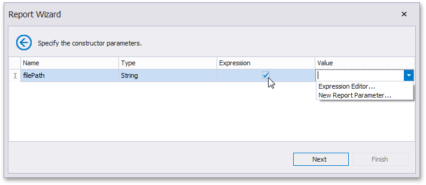

# Specify the Constructor Parameters
> [!NOTE]
> This wizard step appears only if you're creating a new report from scratch. If you're modifying an existing report, this step will not appear and you will start with the [Choose Fields to Display in a Report](../choose-fields-to-display-in-a-report.md) wizard page.

On this wizard page, specify the constructor parameters.

To specify the constructor parameter's value, use the **Value** column. Enable the check box in the **Expression** column to make it possible to specify the parameter expression using the **Expression Editor**. In this case, you can pass an existing [report parameter](../../../../shape-report-data/use-report-parameters.md) to the constructor or even create a new report parameter using the in-place editor.

Click **Next** to proceed to the next wizard page: [Choose Fields to Display in a Report](../choose-fields-to-display-in-a-report.md).